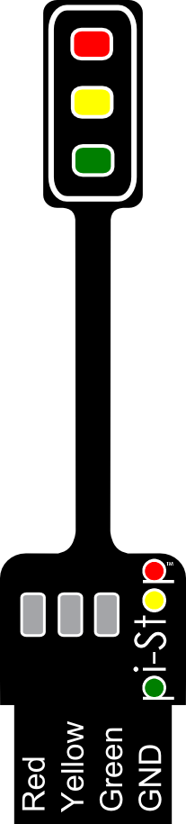
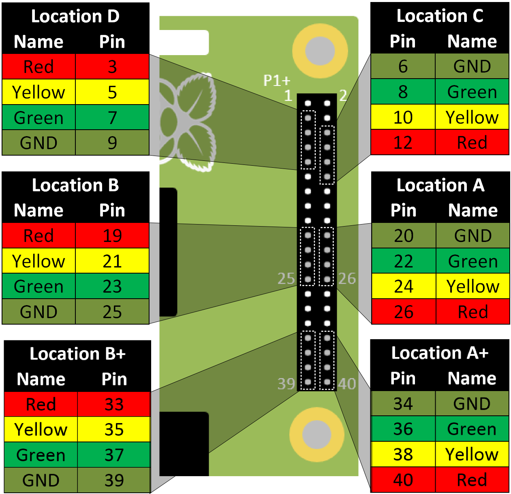
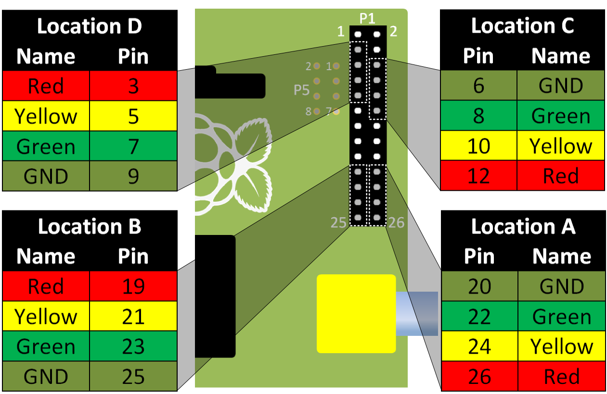
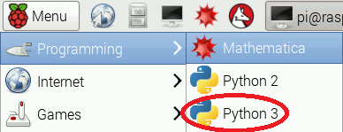
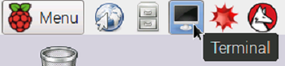

#Create and Solve with Python 1 - PiStop Traffic Chaos (Setup)#
----------

##Panic as PiCity is in Chaos!##
Someone has re-programmed all the traffic lights in the city and now there is traffic chaos.

All the traffic lights have gone haywire in the city and traffic is at a standstill.

The Mayor of PiCity, has put out a desperate plea to anyone who may be able to help to step forward and fix the lights.

Message from the Mayor:

> We urgently need help from talented programmers to write some new software to control the traffic lights correctly.

Can you help?

##Setup##
The Mayor has provided the following to the volunteers.

PiStop traffic lights:

The control software which is contained in the <code>\pistop\pistop.py</code> file.

The code (which someone has re-written) in the <code>trafficlights.py</code> file.

You can use the Raspberry Pi to provide the control for the traffic lights.
  
> 
> **TIP:** If you are not running the code on a Raspberry Pi a **simulated** traffic light will be created.
> 
> You can switch to using a simulated traffic light by changing <code>from pistop.pistop import *</code> to <code>from pistop.pistopsim import *</code> in the <code>trafficlights.py</code> file.
>
> **This can be useful if you think there is a problem with the hardware setup.**
>
> The following files in `\pistop` are used to create the simulated traffic light:
> 
>  `pistopsim.py`, `pygame_pistop.py`, `R.png`, `Y.png`, `G.png`, `pi-Stop.png`

##Positions for the PiStop##
The PiStop is designed to fit in up to 6 pre-set positions on the Raspberry Pi GPIO header.

##Fitting the PiStop##
To begin with we shall use **Location A**:

  
> 
> **TIP:** To find **Pi-Stop Location A** on the 40 pin GPIO header, ensure you count 7 pins directly up from the bottom (that will leave 7 unconnected pins below the Pi-Stop).
> 
> Your Pi-Stop should be facing towards the outside of the Raspberry Pi and inserted on the row of pins nearest the edge.

When we want to use more than one Pi-Stop we can use some of the other locations.

##Starting the desktop and Python 3 (Idle)##
> 
> **NOTE:**   If you are prompted to *login* the default is as follows:
> 
> Username is `pi`
> 
> Password is `raspberry`
>
>To start the Raspberry Pi desktop (if you are currently in commandline mode) type the following command and press enter:
>
> <code>startx</code>

For this workshop we will use the desktop and the **Python 3 (Idle)** editor.  If you are more comfortable using another editor then feel free to use that.

Use the **File->Open...** menu to locate and open the <code>trafficlights.py</code>.

<!--Unless you are using the latest version of Raspbian (Jessie) you will need to start Idle3 with sudo 
To open **Python 3 (Idle)** locate the icon on the desktop and double-click it.  Alternatively, find it located in the **Programming** menu in the Raspberry Pi menu in the top-left.

**Ensure you select Python 3 not Python 2!**

-->
> 
> **TIP:**  
>For older installations on the Raspberry Pi you will have to start Idle3 (the editor) using the commandline using the `sudo idle3` command.  This is because using the GPIO pins was **protected** and required **super user do** permissions, newer installations have relaxed this requirement.
>
> Open the Terminal, locate the **Terminal** icon on the desktop, or through the **Accessories** menu.
>
> 

        
##The Rewritten Code##
The <code>trafficlights.py</code> file has had the original traffic light code removed and a new <code>crazylights()</code> function added!

<pre>
#!/usr/bin/python3
# trafficlights.py
#
# For workshops and further details see https://github.com/PiHw/Pi-Stop
# The PiStop is designed and produced jointly by PiHardware and 4Tronix
#
# Use "from ... import *" to directly import
# the pistop module into the code.
from pistop.pistop import *
import time

#Crazy Light show
def crazylights(pistop):
  pistop.output(r,off)
  pistop.output(g,on)
  time.sleep(0.2)
  pistop.output(g,off)
  pistop.output(y,on)
  time.sleep(0.2)
  pistop.output(y,off)
  pistop.output(r,on)
  time.sleep(0.2)

#Main Code
print("PiCity Chaos!")
with PiStop(hwSetup="A") as myps:
  myps.output(all,on)
  time.sleep(2)
  myps.output(all,off)
  time.sleep(2)
  while True:
    crazylights(myps)

</pre>

<!---
At the top of the file, the following code allows extra functionality to be used from other Python modules.
<pre>
from pistop import *
import time
</pre>

The first line allows us to use the functions provided by the <code>pistop</code> to control the Pi-Stop traffic light.

The second line provides the <code>time.sleep()</code> function to allow a delay between commands.

> 
> **TIP:**   When using <code>import module</code> you will need to refer to the module name when you use it.
> 
> i.e. <code>module.function()</code>
>
> However if you use <code>from module import *</code> you can use all the functions and code directly as if it was contained in the same file.
>
> i.e. <code>function()</code>
--->

See what the program it does by pressing <code>F5</code> or selecting **Run->Run Module** from the menu bar.
__________
Grab the next worksheet and lets see if we can fix these lights!