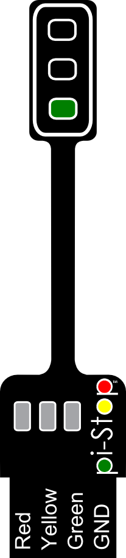
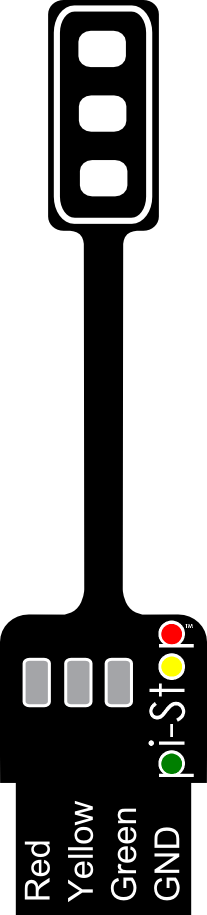

#Create and Solve with Python 2 - PiStop Traffic Chaos (Fix the lights)#
----------

##Fixing the code - Traffic STOP##
The first step in fixing the traffic light code will be to create a function to change the lights to tell the traffic to STOP!

 **Question:** 
What is the traffic light sequence to change from **Green** to **Red**?

We can add new function called <code>trafficSTOP</code> by adding the following code (this must go above the <code>#Main Code</code> comment).

Since we are focusing on changing a traffic light from **GO** to **STOP** we can assume that the traffic light is already **GREEN**.

This means we only need to provide the next two steps (if you've not already guessed this is a **YELLOW** light and a **RED** light).  Of course computers are stupid, so we also need to remember that we must not only tell it what lights we want to switch **ON** but also to switch **OFF** any we don't!

> 
> **TIP:** You can save typing by using the **Cut** and **Paste** options from the menubar (or **Cut** <code>Ctrl+X</code> and **Paste** <code>Ctrl+V</code> shortcuts).

You can see that we use <code>r</code>, <code>y</code> and <code>g</code> to control the **Red**, **Yellow** or **Green** lights.

<pre>
def trafficSTOP(pistop):
  ''' STOP = ->YELLOW->RED '''
  pistop.output(r,off)
  pistop.output(y,on)
  pistop.output(g,off)
  time.sleep(0.2)
  pistop.output(r,on)
  pistop.output(y,off)
  pistop.output(g,off)
  time.sleep(0.2)
</pre>

> **Note:** Python is very fussy about "white space" (that is spaces and tabs).  Spaces at the start of a line of code is very important and is used to group sections of code together (in a function, if statement or loop).
>
>You must use the same number of spaces at the start of each line so Python knows they are together.  This workshop we use two spaces, but you can use more or less if you want to (as long as you keep the same number in each code block).

Next you will need to change the function call in the main section of code, to call our <code>trafficSTOP()</code> function.

We will also add a delay so the lights will remain stopped for a short amount of time (5 seconds), to do this we will use the <code>time.sleep()</code> function.

Change the code below:  
<pre>
  while True:
    crazylights(myps)
</pre>
To match the following:
<pre>
  while True:
    trafficSTOP(myps)
    time.sleep(5)
</pre>

You can test the changes you have made by pressing <code>F5</code> to run it.

> 
> **TIP:** You can also run the code from the commandline with the following command:
>
> <code>sudo python3 trafficlights.py</code>
<!---
> 
> **TIP:**  Depending on the version of the software on the Raspberry Pi you may not need the <code>sudo</code> part of the command (this was required to allow direct access to the hardware which was protected).
--->

##Time to GO?##
Well the lights are still a little crazy, just imagine how confusing it will be for those poor drivers!

...So perhaps we should now add a new function to allow the lights to change back to GO, or the Mayor won't be very happy with us.

Again we need to think about the light sequence we are going to need...
  
 **Question:** 
What is the traffic light sequence to change from **Red** to **Green**?

> **Hint:** You may have to think carefully about this sequence (it is **not** Red -> Yellow -> Green).
>
>Check the traffics lights which are running nearby, you may notice that after Red we have Red **and** Yellow, and then Green!

Once you are sure what the sequence should be, you can create your <code>trafficGO()</code> function.

Use the following code as a guide to create the new function, replacing the <code>????</code> to complete the information in the '''comment''' and to set each light <code>on</code> or <code>off</code>.
<pre>
def trafficGO(pistop):
  ''' GO = ->????->???? '''
  pistop.output(r,????)
  pistop.output(y,????)
  pistop.output(g,????)
  time.sleep(0.2)
  pistop.output(r,????)
  pistop.output(y,????)
  pistop.output(g,????)
  time.sleep(0.2)
</pre>

Finally, we can add a call to this function in our "while loop":
<pre>
  while True:
    trafficSTOP(myps)
    time.sleep(5)
    trafficGO(myps)
    time.sleep(5)
</pre>

Again, we can test the code by pressing <code>F5</code> and see our new code running.

> 
> **NOTE:** A **while loop** is used in the code to perform an action *while the following condition is True*.
> 
> In this case, the condition is just set to <code>True</code> so it will do the action forever (we never want the traffic lights to stop, do we?).  However, we could set this condition to be a logical test instead.
> 
> For example we could have <code>while (PiCityMayor=="Phoebe Cox"):</code> where <code>PiCityMayor</code> could be set to the name of the current Mayor of PiCity at the start of the file.
> 
> So if anyone else is elected as Mayor...all the Traffic Lights will stop!  *However that would be a little unfair to the next Mayor of PiCity wouldn't it, so we won't do that.*

**Excellent! Let's we see if we can make a pedestrian crossing in the next worksheet.**