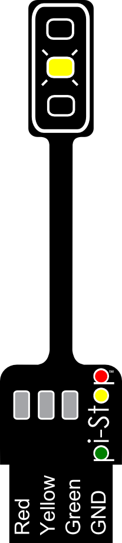
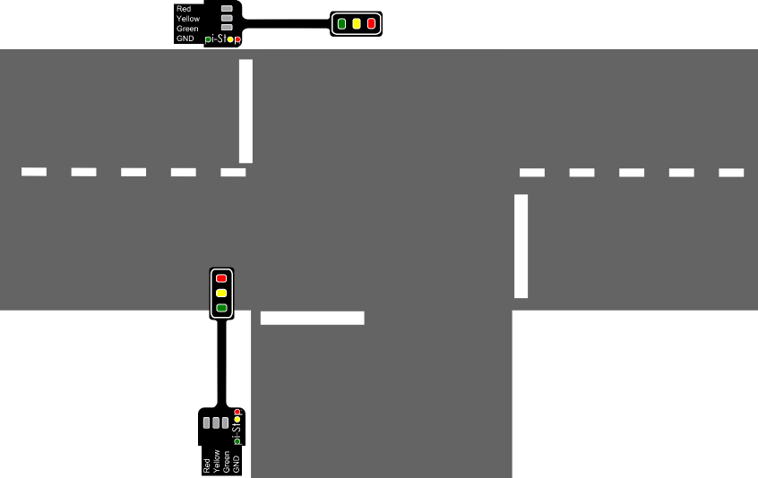
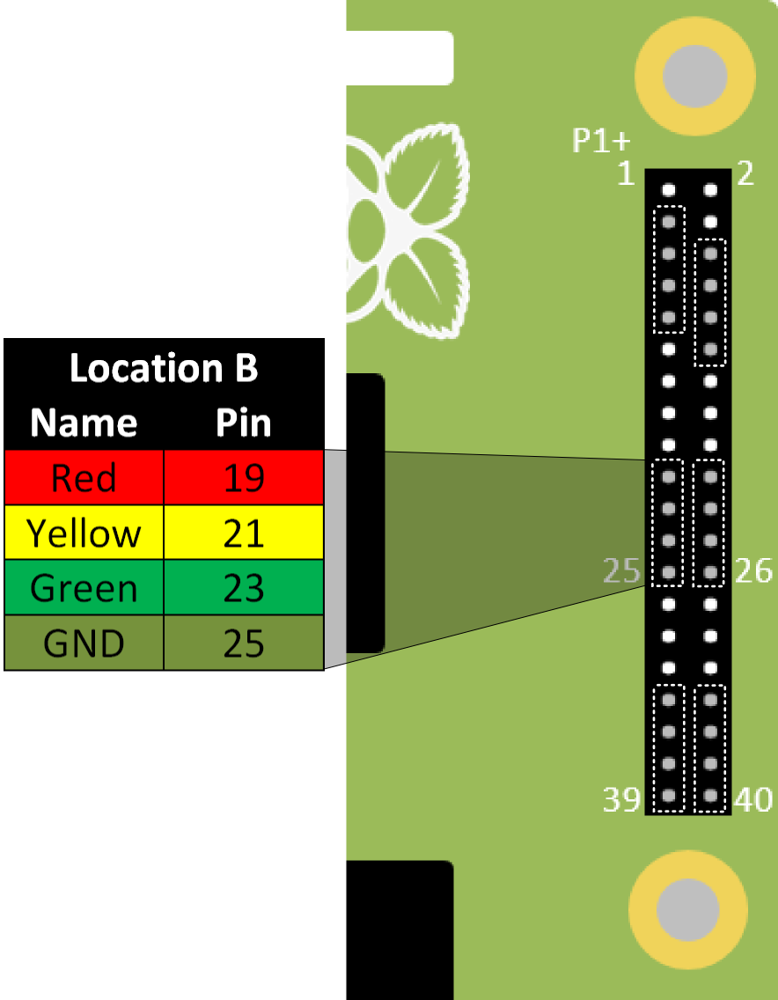
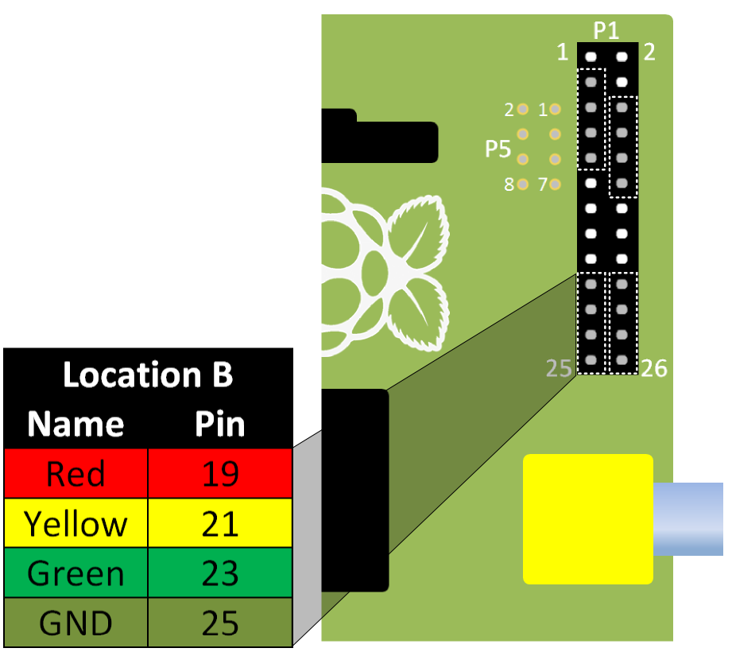
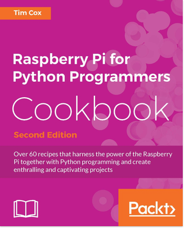

#Create and Solve with Python 3 - PiStop Traffic Chaos (Cross the road)#
----------

##Crossing the road##
The PiCity also includes a number of pedestrian crossings.  We want to allow people to press a button to make the light change and allow a short time for crossing.

> 
> **NOTE:** Remember on a pedestrian crossing, initially the light is **Green** to allow the traffic to **GO**.  When the pedestrian presses the button, often there is a **wait** before the light turns **Red** and the traffic should **STOP**.

We can use the <code>Enter</code> key on the keyboard as the button the pedestrian.  The following code will allow our code to wait for the button to be pressed before continuing:
<pre>
input("Press enter to cross")
</pre>

> 
> **TIP:** You will find it is often easier to write code in stages and testing each step as you go.  That way it is a lot easier to fix any errors one at a time.
>
> Test the code for each step to check it does what you expect and adjust it as needed.

Write the following code within the <code>while</code> loop:

**Step 1:** Allow the traffic to **GO** `trafficGO(myps)` by changing the lights to **Green**.

**Step 2:** Add code to wait for the enter key to be pressed `input("Press enter to cross")`

**Step 3:** Add a delay using <code>time.sleep(2)</code> and make the traffic **STOP** `trafficSTOP(myps)`.

**Step 4:** Add another delay for the pedestrians to cross, `time.sleep(5)`, before changing the lights to allow the traffic to **GO** once more.

###Adding a flashing warning light###

Some crossings give pedestrians a little extra time to cross by making the **Yellow** traffic light **flash** before finally turning **Red**.

    
We can do this by making another function:
<pre>
def flashYellow(pistop):
  '''Flash Yellow Light'''
  pistop.output(all,off)
  for i in range(4):
    pistop.output(y,on)
    time.sleep(0.2)
    pistop.output(y,off)
    time.sleep(0.2)
</pre>

The <code>for i in range(4):</code> will perform the following code in a loop, just like the while loop.  However this time, it will only do it for each item in a list...where <code>range(4)</code> is the same as writing <code>(0,1,2,3)</code> it would loop through the code 4 times.

> 
> 
> **TIP:** If we want traffic lights on either side of the crossing will perform the same actions, we don't need to program them separately.  We can wire them to the same control pins using the Pi-Stop stands and wires to make more than one traffic light change at the same time.

 

##What is next?###

**QUESTION:** How can we change the code to control another traffic light to stop the traffic coming the other way at a junction?

Well it is probably easier than you think, as you will see in a moment.

We shall use **Location B** for our second traffic light (*ask for an extra Pi-Stop if you don't have one yet*):

> 
> **TIP:** To find **Pi-Stop Location B** on the 40 pin GPIO header, ensure you count 7 pins directly up from the bottom (that will leave 7 unconnected pins below the Pi-Stop).
> 
> Your Pi-Stop should be facing towards the middle of the Raspberry Pi and inserted on the row of pins away from the edge.  It'll be back-to-back to the Pi-Stop on location A, facing to the middle of the Raspberry Pi.

Now we change the code below:
<pre>
with PiStop(hwSetup="A") as myps:
</pre>
To match the following:
<pre>
with PiStop(hwSetup="A") as mypsa, \
     PiStop(hwSetup="B") as mypsb:
</pre>

> 
> **TIP:** The <code>\</code> character is important, this tells Python that you've not finished the line of code yet and to continue to the next line.  This also makes it easier for us to read and understand.

We now have a 2nd Traffic Light to play with, called <code>mypsb</code>...

> 
> Do you think you can work out how to make the 2nd Traffic Light change to GO when the 1st one changes to STOP?
> 
> *Have a try, but don't worry if you get stuck feel free to ask for some help!*

 

##Extra Credit##
Complete the following tasks to a complete your PiStop Traffic Light guide.
> 
> **QUESTION 1:** Try extending the <code>trafficlight.py</code> to support all six PiStop locations (or all four locations if using a 26-pin Raspberry Pi).

> 
> **QUESTION 2:** Design a road layout which makes use of all the lights to control multiple flows of traffic from different directions.

##Congratulations##

You have completed the workshop, great work!

The Mayor is very pleased you have saved the day.

##Additional Information##
If you enjoyed the workshop and would like additional information please visit my website (including other workshops and kits):

**[http://www.pihardware.com](http://www.pihardware.com)**

Pi-Stops are available to buy at the workshop, £3 each or £5 for two.

Alternatively you can purchase them online at:

**[http://4tronix.co.uk](http://4tronix.co.uk)**

**[http://cpc.farnell.com](http://cpc.farnell.com)**

Also, be sure to check out the **2nd edition** of my book for lots of in-depth project ideas (**[http://goo.gl/xWd42k](http://goo.gl/xWd42k)**):
