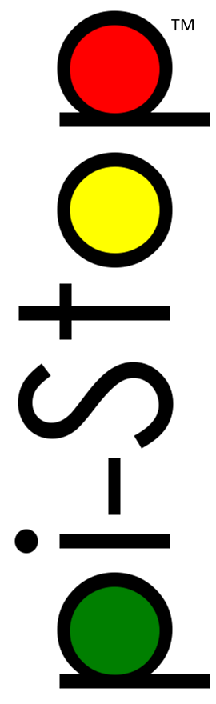
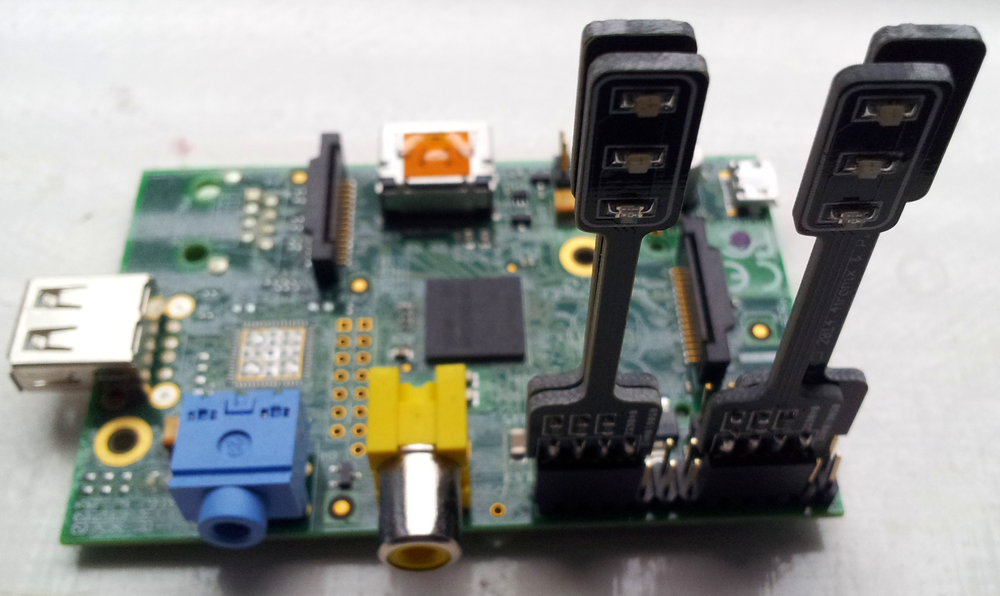
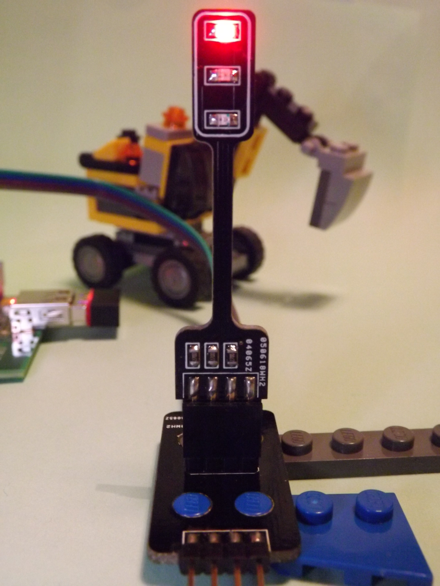
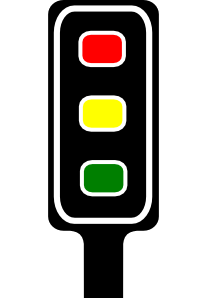

##[PiHardware.com](http://pihardware.com) presents...##

##Introducing the Pi-Stop##
The Pi-Stop is a low cost hardware module designed to allow Raspberry Pi users to take their first steps into interfacing with the real world.

Designed with the learning in mind, everyone will recognise and identify its familiar elements encouraging their use along-side their own projects.

###Move past the Stop light###
The Pi-Stop is designed to remove many of the common hurdles people are faced with when getting started using hardware with the Raspberry Pi. Often it is difficult to know what components to use and how to connect them, the Pi-Stop makes it simple by plugging directly onto pre-set positions on the Raspberry GPIO connector.

By plugging the Pi-Stop directly on to the Raspberry Pi GPIO header, no extra cables or wires are needed.  Unlike many other add-on boards, they do not block unused GPIO pins, keeping them open for other uses.  The Pi-Stop can be fitted in 4 standard locations, allowing up to four Pi-Stops to be controlled independently or combined with other hardware.

When used with optional stands, they can be used away from the GPIO header and even daisy chained to make up full traffic light sets.

*For more information about the many ways the Pi-Stop is fitted see the Pi-Stop documentation below.*

###Prepare to go!###
The Pi-Stop provides a simple stepping stone, between pure screen based programming and using physical hardware to interact with the real world.  Components like the Pi-Stop will provide a flexible and non-restrictive way to build understanding through experimenting.

Since it is only a step away from a bag of components, it also allows the programming of hardware to be introduced, and the electronics involved can be introduced separately, if desired.  Allowing the pupils to discover they can control real things, and then again to discover they can also build their own circuits and control them in exactly the same way.

Often, people are faced with a magic board which they plug in and tell it to do stuff, however it isn't always clear to them why or how it does it.  By providing something which they can remove and replace with something (apparently) completely different (- wires, breadboards and LEDs) they will be able to understand the link.

By keeping the hardware very simple, it allows better understanding of what is happening, and allows space to come up with your own projects and apply the concepts with your own ideas in mind.

###GO Full throttle###
The documentation and guides are openly available for the Pi-Stop for educational use.  There will be guides, tutorials and workshop material available all of which can be taken *as is* [available as PDF format] or adapted to your own needs [available in markdown format].

It is encouraged that similar materials can be submitted back for others also to share and make use of.
 
The materials will demonstrate the concepts, methods and provide the building blocks to explore ideas and take learning further by with creative projects, activities and games.

# Pi-Stop Documentation #

The following material is available (in both PDF and markdown format):

[**Discover: The Pi-Stop**](markdown_source/markdown/Discover-PiStop.md): Learn what the Pi-Stop is and how to use it.

[**Setup: Scratch GPIO**](markdown_source/markdown/Setup-ScratchGPIO.md): Get up and running with Scratch GPIO ready to use with the Pi-Stop.

[**Explore and Challenge Scratch GPIO: Pi-Stop First Steps**](markdown_source/markdown/ExploreScratchGPIO-PiStopFirstSteps.md): If you've not used Scratch before, this will provide a quick introduction to building your first Scratch GPIO program.

[**Explore and Challenge Scratch GPIO: Pi-Stop Traffic Sequence**](markdown_source/markdown/ExploreScratchGPIO-PiStopTrafficSequence.md) - Create your own traffic light sequence and learn how to use Scratch GPIO with the **Pi-Stop**.

[**Explore and Challenge Scratch GPIO: Pi-Stop Reaction Game**](markdown_source/markdown/ExploreScratchGPIO-PiStopReactionGame.md) - How fast are your reflexes?  Test your reaction time with the **Pi-Stop** Reaction game.

[**Explore and Challenge Scratch GPIO: Pi-Stop Simon Memory Game**](markdown_source/markdown/ExploreScratchGPIO-PiStopMemoryGame.md) - Challenge your memory and get the highest score!

# Workshop Materials #
The workshop materials will be split into four areas:

**Discover**: This will provide useful reference information for the user which will be useful later on.

**Setup**: This contains important information on how to setup your system correctly before you start.

**Explore and Challenge**: Step by step guide to gradually introduce the concepts and ideas while applying existing skills and knowledge.  These provide an introduction with clear walk-through to a solution, making it an excellent place to get started. 

**Create and Solve**: We encouraging problem solving by presenting a problem, and providing the components to a possible solution.

Supporting worksheets:

**Worksheets**: The workshop is structured using the worksheets which will tie together the materials, provide space for note taking and a means to keep track of progress. 

##Example Workshop##
The following materials were used at the Digimakers Bristol event held the @Bristol Science Centre (14th June 2014) - ready to print PDF format.

Suitable for age 6 and upwards (probably less with extra guidance), runs for 1 to 2 hours depending on ability/creativity.

1. [**Setup: Scratch GPIO (workshop version)**](pdf/WS-Setup-ScratchGPIO.pdf) - Explains how to setup Scratch GPIO

1. [**Explore and Challenge Scratch GPIO: Pi-Stop First Steps**](pdf/ExploreScratchGPIO-PiStopFirstSteps.pdf) - Introduces how to use Scratch and using Scratch GPIO.  *If you are already familiar with Scratch you can skip this.*

1. [**Explore and Challenge Scratch GPIO: Pi-Stop Traffic Sequence**](pdf/ExploreScratchGPIO-PiStopTrafficSequence.pdf) - Create your own traffic light sequence and learn how to use Scratch GPIO with the **Pi-Stop**.

1. [**Explore and Challenge Scratch GPIO: Pi-Stop Reaction Game**](pdf/ExploreScratchGPIO-PiStopReactionGame.pdf) - How fast are your reflexes?  Test your reaction time with the **Pi-Stop** Reaction game.

1. [**Explore and Challenge Scratch GPIO: Pi-Stop Simon Memory Game**](pdf/ExploreScratchGPIO-PiStopMemoryGame.pdf) - Challenge your memory and get the highest score!

[**Workshop Worksheet**](pdf/WS-Worksheet.pdf) - Used for participants to keep track of their progress during the workshop. 

----------

On your marks...

Get set...

**GO!**

-----------

# Where to get your Pi-Stop #

The Pi-Stop was designed in partnership between [4Tronix.co.uk](http://4Tronix.co.uk) and [PiHardware.com](http://pihardware.com).

The Pi-Stop is available from the [4Tronix.co.uk](http://4Tronix.co.uk) shop.

--------------------------
 The materials within this Git-Hub repository are licensed under a <a rel="license" href="http://creativecommons.org/licenses/by-nc-sa/4.0/">Creative Commons Attribution-NonCommercial-ShareAlike 4.0 International License</a>

----------------------
*The Pi-Stop name and logo are Trademark of PiHardware.com and the design is Copyright 2014 of 4Tronix.com and PiHardware.com.*