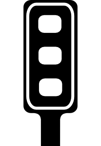
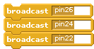
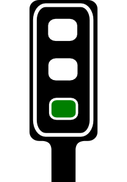

<!-- File generated from pihw.com (_inc\both_models\start.txt) -->
<!-- File generated from pihw.com (_inc\standard\start.txt) -->




<!-- How to use comments in these files -->
<!-- ---------------------------------- -->
<!--Comments have been put in this file so that they can be customised for a range of workshops and uses.

[How to customise the Markdown documents](CustomMarkdown.md)-->

<!-- -----------------------------------------------------
-->
<!-- Enable sections for the new model plus (Post-July 2014) define  -->
<!-- Enable sections for the older model (Pre-July 2014)  define  -->
<!-- -----------------------------------------------------
-->



----------





##NAME:##
-----------------

##[**Setup: Scratch GPIO**](Setup-ScratchGPIO.md)##


Explains how to setup Scratch GPIO.

*You must perform this step in order to use the **Pi-Stop** with Scratch.*
 **I have installed Scratch GPIO!**





 **I have powered down the Raspberry Pi and fitted the Pi-Stop in Location A**



**Location A for Model A+ or B+ (purchased after July 2014)**

**Location A for Model A or B (purchased before July 2014)**



 **I have tested Scratch GPIO with the Pi-Stop and it works!** 






##[**Explore and Challenge Scratch GPIO: Pi-Stop First Steps**](ExploreScratchGPIO-PiStopFirstSteps.md)##

Introduces how to use Scratch and using Scratch GPIO.

*If you are already familiar with Scratch you can skip this.*
 **I now know the different parts of Scatch**





 **Scratch GPIO with a Flashing RED Light Completed!**






##[**Explore and Challenge Scratch GPIO: Pi-Stop Traffic Sequence**](ExploreScratchGPIO-PiStopTrafficSequence.md)##

Create your own traffic light sequence and learn how to use Scratch GPIO with the **Pi-Stop**.

**WORKSHEET:** Colour in the correct traffic light order below, then fill in the required **broadcast** commands **on** or **off**.
Use the following diagram to determine which pins are connected with each colour on the traffic light.


First the traffic light sequence for changing from **STOP** to **GO**.
#STOP#



-----------------
#PREPARE TO GO#



-----------------
#Wait#
To stop the lights changing instantly, we need to wait before we change them again!



-----------------
#GO#







**Traffic Light Sequence STOP to GO**

------------------
------------------
Next the traffic light sequence for changing from **GO** back to **STOP**. 
#GO#



-----------------
#PREPARE TO STOP#


-----------------
#Wait#
Again, to stop the lights changing instantly, we need to wait.


-----------------

#STOP#








**Traffic Light Sequence GO to STOP**



--------


**I've created the Pi-Stop STOP and GO sequences**





**I've created the Pi-Stop the full Traffic Light Sequence**





**Extended Task: Created a racing start light control**





**Extended Task: Controlled two Pi-Stops at the same time!**




##[**Explore and Challenge Scratch GPIO: Pi-Stop Reaction Game**](ExploreScratchGPIO-PiStopReactionGame.md)##

How fast are your reflexes?  Test your reaction time with the Pi-Stop Reaction game.




 **WORKSHEET:** Tick the checkbox marked **"I've created the Pi-Stop Reaction Game"**.

***Don't forget to write down your best score!***





##[**Explore and Challenge Scratch GPIO: Pi-Stop Simon Memory Game**](ExploreScratchGPIO-PiStopSimonGame.md)##

Challenge your memory and get the highest score!

 **WORKSHEET:** Tick the checkbox marked **"The first part of the Pi-Stop Simon Memory Game works!"**.





 **WORKSHEET:** Tick the checkbox marked **"I've created the Pi-Stop Simon Memory Game"**.

***Don't forget to write down your best score!***




--------------------
**Congratulations: You have reached the end of the workshop!**


I hope you enjoyed it.

Remember the **Pi-Stop** will be available to buy from [www.4tronix.co.uk](http://www.4tronix.co.uk), and additional material and guides will be available from my website [www.PiHardware.com ](http://www.PiHardware.com )


> To reserve your own Pi-Stops, to enquire about **classroom/workshop packs**, or for Raspberry Pi help/advice:

> Contact  me (Tim Cox) at [pihw-orders@hotmail.co.uk](pihw-orders@hotmail.co.uk)

My ***Raspberry Pi Python Cookbook for Python Programmers*** is available to buy:

**[http://goo.gl/dmVtsc](http://goo.gl/dmVtsc)**






<!-- File generated from pihw.com (_inc\both_models\stop.txt) -->
<!-- File generated from pihw.com (_incstandardstop.txt) -->