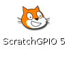
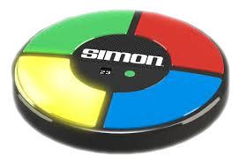
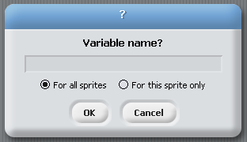
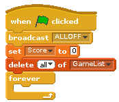
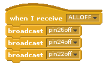
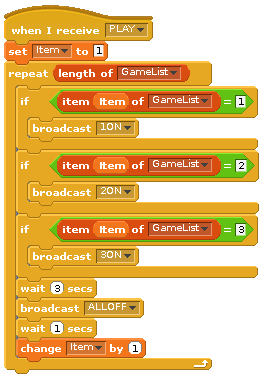
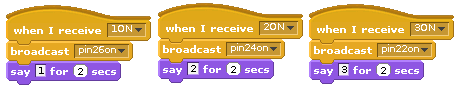
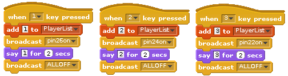
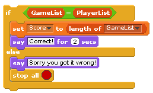
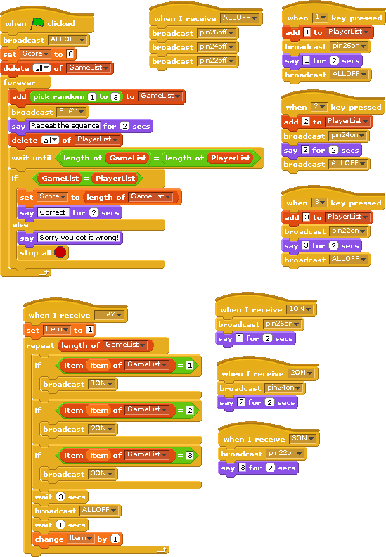

<!-- File generated from pihw.com (_inc\model_original_only\start.txt) -->
<!-- File generated from pihw.com (_inc\standard\start.txt) -->




<!-- How to use comments in these files -->
<!-- ---------------------------------- -->
<!--Comments have been put in this file so that they can be customised for a range of workshops and uses.

[How to customise the Markdown documents](CustomMarkdown.md)-->

<!-- -----------------------------------------------------
-->
<!-- Enable sections for the new model plus (Post-July 2014) define WANT_MODEL_PLUS -->
<!-- Enable sections for the older model (Pre-July 2014)  define  -->
<!-- -----------------------------------------------------
-->




----------


#Explore and Challenge:#
##The Pi-Stop Simon Memory Game##

> 
> **SEE ALSO:**
>  
> [**Setup: Scratch GPIO**](Setup-ScratchGPIO.md): For instructions on how to setup Scratch GPIO with Pi-Stop *(which is needed for this guide)*.
>
> [**Explore and Challenge Scratch GPIO: Pi-Stop First Steps**](ExploreScratchGPIO-PiStopFirstSteps.md): If you've not used Scratch before, this will provide a quick introduction to building your first Scratch GPIO program.
> 
> [**Explore and Challenge Scratch GPIO: Pi-Stop Traffic Sequence**](ExploreScratchGPIO-PiStopTrafficSequence.md) - Create your own traffic light sequence and learn how to use Scratch GPIO with the **Pi-Stop**.

In this guide we will use the **Pi-Stop** to test our memories.

In 1956 a very famous *psychologist* (someone who studies how we think) called **George Miller** stated that on average most people will be able to remember up to seven items (plus or minus two).

I wonder if we can prove if Miller's **"Magic Number Seven"** is true or not?  We can write a game which will test this *hypothesis* (the theory/idea) by challenging our friends.


*Who will have the best memory at the workshop?*

###Getting Started###
As in previous guides, the Pi-Stop should be connected to the Raspberry Pi in **Location A**, as follows:
**Location A for Model A or B (purchased before July 2014)**

With the Pi-Stop fitted in the correct position you can now power up your Raspberry Pi.

Once you have started the Raspberry Pi desktop, open Scratch using the Scratch GPIO icon:


##Simon Memory Game##
The following game is similar to a well known game from the 1980's which creates an ever increasing sequence of lights which the player has to repeat by pressing the lights in turn.

We will create our own version using the three lights of the Pi-Stop and the keys "1", "2" and "3" on the keyboard.

###Setup the game###
We ensure that everything is ready when we start a new game.

First we will need a variable for our **Score**:

 - Select the **Variables** tab and add a new variable by pressing the **"Make a variable"** button, call it **Score** and set it to be **For all sprites**.



We will also need to create a list to hold our sequence of lights, we will call it **GameList**:

 - Press the **"Make a list"** button, call it **GameList** and set it to be **For all sprites**


> 
> **NOTE:** Remember the tick next to it controls if it is displayed on in the main Scratch window.
> 
> For this game, being able to see the numbers in the **GameList** would allow you to cheat, so it is worth hiding it when you are playing it properly (I suggest you leave it visible for now so you can see the game working).

We can now create the first section to do the following:

 1. Switch OFF all the lights - We can use an **ALLOFF broadcast** group as we have done in previous guides.
 2. We reset the **Score** to 0.
 3. We empty all any previous items in the **GameList**


#####We do this with:#####



> 
> **NOTE:** All the remaining parts of the game will now go inside the **forever** block, so the game will continue until we stop it.

###Create and play the GameList sequence###
Within the forever loop in the main set of blocks, we can now add a new item to the **GameList** (a random number between 1 and 3) and run a new **broadcast** group block called **PLAY**.



The **PLAY broadcast** group block will go through each item in the **GameList**, then **broadcast** one of the following depending on the number in the list:

1. **1ON** - Switch on RED light (*pin26on*)
2. **2ON** - Switch on YELLOW light (*pin24on*)
3. **3ON** - Switch on GREEN light (*pin22on*)

> 
> **NOTE:** You will also need another **variable** called **Item** - this allows us to keep track of where we are within the list.  Ensure you add this by creating it in the **Variables** tab.





###Test our program###
You can now test the program by clicking on the *Green Flag* and see what the program does.

*We should have an ever growing repeating sequence of light patterns!*


 **WORKSHEET:** Tick the checkbox marked **"The first part of the Pi-Stop Simon Memory Game works!"**.

###The players turn###
The player will need to press the correct keys in order to see if they can match the **GameList**, we will store the player's choices in a new **List** called **PlayerList**.

We can now add some blocks to the main program inside of the **forever** loop, to let the player attempt to recreate the sequence of lights stored in the **GameList**:

- Tell the player to ***"Repeat the sequence"*** and ensure the **PlayerList** has been cleared.
- Allow the player to enter their own sequence by detecting each key press **"1"**, **"2"** and **"3"** and add them to the **PlayerList**.  We will also light up the corresponding LED to show the sequence on the Pi-Stop.
- We will continue waiting for the players key presses until we have the same number of items as the **GameList**






###What's the Score?###
Finally, in the last part of the main game loop we see if the **GameList** matches the **PlayerList**:

- If the **GameList** is the same as the recorded **PlayerList** we can update the **Score** and continue (which will add another random light for the player to remember).
- If the **GameList** is different then we will **stop** the script, the player made a mistake and the game has ended!


**Congratulations!**
You finished program should look something like the following.



 **WORKSHEET:** Tick the checkbox marked **"I've created the Pi-Stop Simon Memory Game"**.





***Don't forget to write down your best score!***


<!-- File generated from pihw.com (_inc\model_original_only\stop.txt) -->
<!-- File generated from pihw.com (_incstandardstop.txt) -->
