<!-- File generated from pihw.com (_inc\model_original_only\start.txt) -->
<!-- File generated from pihw.com (_inc\standard\start.txt) -->




<!-- How to use comments in these files -->
<!-- ---------------------------------- -->
<!--Comments have been put in this file so that they can be customised for a range of workshops and uses.

[How to customise the Markdown documents](CustomMarkdown.md)-->

<!-- -----------------------------------------------------
-->
<!-- Enable sections for the new model plus (Post-July 2014) define WANT_MODEL_PLUS -->
<!-- Enable sections for the older model (Pre-July 2014)  define  -->
<!-- -----------------------------------------------------
-->




----------


#Explore and Challenge:#
##The Pi-Stop Reaction Game##
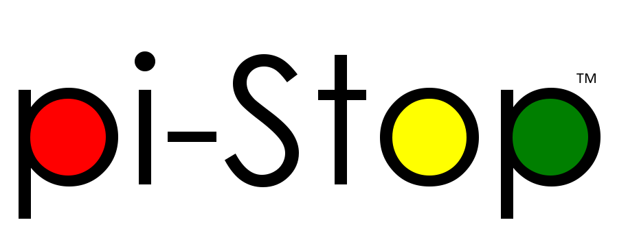
> 
> **SEE ALSO:**
>  
> [**Setup: Scratch GPIO**](Setup-ScratchGPIO.md): For instructions on how to setup Scratch GPIO with Pi-Stop *(which is needed for this guide)*.
>
> [**Explore and Challenge Scratch GPIO: Pi-Stop First Steps**](ExploreScratchGPIO-PiStopFirstSteps.md): If you've not used Scratch before, this will provide a quick introduction to building your first Scratch GPIO program.
> 
> [**Explore and Challenge Scratch GPIO: Pi-Stop Traffic Sequence**](ExploreScratchGPIO-PiStopTrafficSequence.md) - Create your own traffic light sequence and learn how to use Scratch GPIO with the **Pi-Stop**.

In this guide we will use the **Pi-Stop** in a game of fast reactions.

Our program will make the Pi-Stop light up after a random delay, then time how long it takes for us to press the SPACE button on our keyboard in response.

The program will also track your best score!

*Who will be the fastest person in the workshop?*

###Getting Started###
As in previous guides, the Pi-Stop should be connected to the Raspberry Pi in Location A, as follows:
**Location A for Model A or B (purchased before July 2014)**
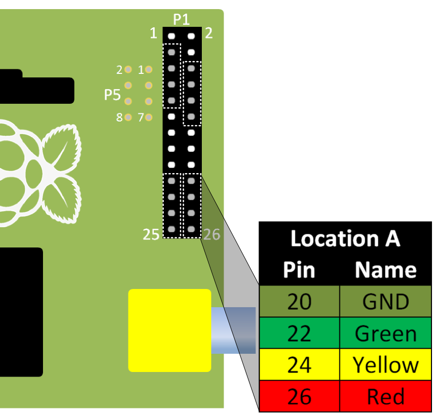
With the Pi-Stop fitted in the correct position you can now power up your Raspberry Pi.

Once you have started the Raspberry Pi desktop, open Scratch using the Scratch GPIO icon:
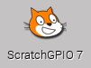



##Design: The Reaction Game##
We will break the game down into smaller sections so we can build it up piece by piece.

Lets think about how we want the game to function:

1. **Setup and Wait for user** - *Ensure the player and game is ready.*
2. **Start the game** - *Switch OFF the lights and see how long the player takes.*
3. **Work out the scores!** - *Workout the player's reaction time.*
4. **Who is the fastest?** - *See if the player is the fastest.*
5. **Next round!** - *Give the player another go.*

First we will need some *"variables"* to hold our information:

- Add a new variable by pressing the **"Make a variable"** button in the **Variables** tab.

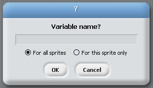

- Create a new variable **Fastest Score**, set it to be **For all sprites**.  This will create a new item in the **Variables** tab.

> 
> **NOTE:** The tick next to it controls if it is displayed on in the main Scratch window.  For this game, it doesn't matter if they are visible so you can leave them ticked.

- Create the following variables to use in our game:

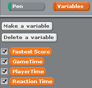
 

We will also setup some **broadcast** group blocks as before, to control our lights.  We just need an **ALLON** and an **ALLOFF** **broadcast** group block to switch ON or OFF the lights.


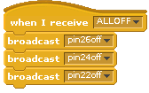



###1. Setup and Wait for user###
The game should wait for the use to press a key (for example the UP ARROW key).

#####We do this with:#####
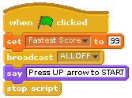
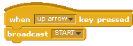
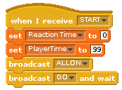

> 
> **NOTE:** **GO** will be a **broadcast** group block which runs the game (see the next section).
> 
> We have to use a **broadcast **"GO"** and wait** block, otherwise Scratch will continue on and try to work out the scores before the player has had chance to play the game.  The **wait** part ensures this block is finished before moving onto the next block.
> 





###2. Start the game###
Next the game should tell the player what to do ***"Press SPACE when the lights go out!"*** and switch ON the lights

We will measure the players reactions by counting the time the user takes to press the SPACE key and compare it with the time the LEDs go out!

This is done with the following steps:

- We start our timer
- Wait for a random amount of time
- Switch OFF the lights
- Measure the time when we switch OFF the lights
- Measure the time when the player presses the SPACE key

#####We do this with:#####
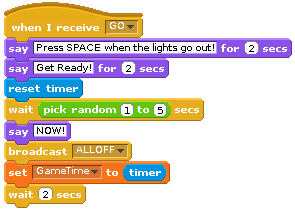
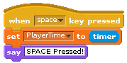

The key part here is the **pick random *1* to *5*** to provide a unknown **wait** time before we switch OFF the lights.

###3. Work out the scores!###

After the game round has finished, we will need to work out the scores.

We will have the time the player pressed the SPACE key (the *"PlayerTime"*) verses the time the lights switched OFF (the *"GameTime"*).

From this we can work out which of the following three things has happened:

1. The player saw the lights go OFF and they pressed the SPACE key shortly after **(GOOD)**
2. The player forgets to press the SPACE key **(BAD)**
3. The player pressed the SPACE key too soon **(BAD)**

By checking if the *"PlayerTime"* is shorter than the *"GameTime"*, we will know they pressed too soon (case 3).

If that happens, we should tell them (so they know to wait next time ***"Too Fast!"***) and give them a very bad score for not waiting/cheating!

If the *"PlayerTime"* is equal to its initial value than the player didn't press the SPACE key at all.  Again, we will tell them ***"Too Slow!"*** and give them a bad score.

If the *"PlayerTime"* is longer than the *"GameTime"*, they have pressed the SPACE key after the lights switched OFF.  Their score will be the difference between the  *"GameTime"* and the *"PlayerTime"*, their ***"Reaction Time"***!

#####We do this with:#####
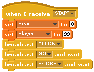
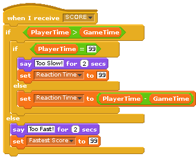

We add another **broadcast  and wait** block (to run our new **"SCORE"** block) to the main **"START"** broadcast group block.

###4. Who is the fastest?###
 
Next we work out if the *"Reaction Time"** faster than the *"Fastest Score"*, if it is we can set a new *"Fastest Score"*.

#####We do this with:#####
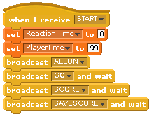
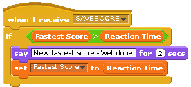

###5. Next round!###

Finally, we tell the player ***"Press UP arrow to START"*** and restart (without resetting the *"Fastest Score"*).

#####We do this with:#####
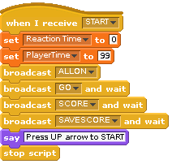

> 
> **NOTE:** This block will restart as soon as the player presses the UP arrow.
> 


By breaking our game into smaller tasks, it was a lot easier to make! 

*Amazing, you have created your first game in Scratch!*


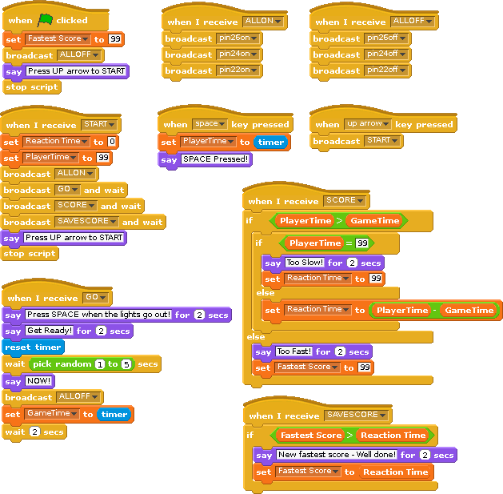



 **WORKSHEET:** Tick the checkbox marked **"I've created the Pi-Stop Reaction Game"**.

***Don't forget to write down your best score!***

##Can you make this game more challenging?##

Try making this game more difficult by randomly picking a different LED each time, and make the player will need to select the correct LED (1, 2 or 3) in order to score!

------------------
*You are now ready to move onto the next guide:*
[**Explore and Challenge Scratch GPIO: Pi-Stop Simon Memory Game**](ExploreScratchGPIO-PiStopMemoryGame.md).

<!-- File generated from pihw.com (_inc\model_original_only\stop.txt) -->
<!-- File generated from pihw.com (_incstandardstop.txt) -->