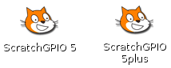

<!-- File generated from pihw.com (_inc\model_plus_only\start.txt) -->
<!-- File generated from pihw.com (_inc\standard\start.txt) -->




<!-- How to use comments in these files -->
<!-- ---------------------------------- -->
<!--Comments have been put in this file so that they can be customised for a range of workshops and uses.

[How to customise the Markdown documents](CustomMarkdown.md)-->

<!-- -----------------------------------------------------
-->
<!-- Enable sections for the new model plus (Post-July 2014) define  -->
<!-- Enable sections for the older model (Pre-July 2014)  define WANT_MODEL_ORG -->
<!-- -----------------------------------------------------
-->




----------

#Setup: Scratch GPIO#

##What is Scratch?##
**Scratch** is a beginner friendly way to program the Raspberry Pi, designed for those who have not programmed before and are put off by the random keyboard mashing type code normal programming typically produces.

Programs are simply created by dragging and dropping various types of blocks together to produce a sequence of instructions to follow.  The default character who is tasked with following all these instructions is “Scratch” the cat!

A typical program is shown below:


On the surface Scratch is deceptively simple, however do not let that fool you, there is a lot that can be done by putting a few blocks together and because you are not distracted by syntax and confusing commands, you can really focus bring your ideas to life and what you want to achieve.

##Introducing Scratch GPIO##
**Scratch GPIO** was created by **Simon Walters (@cymplecy)** to allow Scratch to interact with physical hardware.  Full details of Scratch GPIO is available on his website:

[http://cymplecy.wordpress.com/scratchgpio/](http://cymplecy.wordpress.com/scratchgpio/)

##How to install Scratch GPIO##
###Obtain Scratch GPIO###
Scratch GPIO is installed from a single setup file.

If an internet connection is available, obtain the Scratch GPIO setup file by running the following command.

    sudo wget http://goo.gl/Pthh62 –O install_scratchgpio5.sh

Or download the file directly on another computer and copy it to your Raspberry Pi SD-Card or a USB drive (see the **TIPs** below for details on how to access it on the Raspberry Pi):

[http://goo.gl/Pthh62](http://goo.gl/Pthh62)

> 
> **TIP:** In the workshop, preconfigured SD-Cards are available which can also be connected to the USB of the Raspberry Pi.  They will contain the required setup file.


###Run the install script###
Run the script to install Scratch GPIO using the following command:

    sudo bash install_scratchgpio5.sh

It is as simple as that, Scratch GPIO is installed on your system!

*If you have any problems, see the **TIPs** below for additional help.*

###Safely shutdown your Raspberry Pi###
Before we continue, you will need to **shutdown and power off** the Raspberry Pi so we can fit our hardware onto the GPIO pins.
> **WARNING:** It is advisable to only connect and disconnect hardware to the GPIO pins when the Raspberry Pi is switched off to avoid damage.

If your Raspberry Pi automatically starts in the desktop, click on the red power button in the bottom right corner and select **Shutdown** from the menu which comes up.  Or open a terminal window (by clicking on the Terminal icon or selecting from the menu).

From the terminal type the command `sudo shutdown -h now`.

When the green activity **(ACT) LED** on the Raspberry Pi has stopped flashing (for over 5 seconds) you can safely disconnect the power.




 **WORKSHEET:** Put a big tick in the checkbox marked **"I have installed Scratch GPIO!"** 


-----------


> 
> **TIP 1:** If you have a different user name to the default pi user, use the following command:

>    `sudo bash install_scratchgpio5.sh yourid`




> 
> **TIP 2:** If you have copied the file to your Raspberry Pi SD-Card you can access it as shown below (depending if you have a NOOBS setup or not).

>When using NOOBS, only the RECOVERY partition of the SD-Card will be visible on many computers, so you can copy the file there.  To access this partition on the Raspberry Pi it will need to be mounted before you can run the script:
>
>`mkdir ~/recovery`
>
>`sudo mount –t vfat /dev/mmcblk0p1 ~/recovery`
>
>`sudo bash ~/recovery/install_scratchgpio5.sh`
>
>If using a basic imaged system (non-NOOBS), the file can be run directly from the BOOT partition:
>
>`sudo bash /dev/boot/install_scratchgpio5.sh`


> 
> **TIP 3:** If you have the files on a USB device, you can access the `install_scratchgpio5.sh` as follows:
> 
> Insert the USB device or USB SD-Card reader with the Workshop SD-Card inside, into one of the Raspberry Pi's SD-Card.
> 
> From the terminal, use the following command:
> 
> `sudo fdisk -l`
> 
> This will list all the drives and partitions detected on the system (if it is not detected as **sda1** you can adjust the commands as needed).
>
> `mkdir ~/sdcard`
> 
> `sudo mount –t vfat /dev/sda1 ~/sdcard`
>
> `sudo bash ~/sdcard/install_scratchgpio5.sh`

-------------------


##How does it work?##
###The broadcast block###
In addition to the normal Scratch blocks as shown above, Scratch is able to *shout* (called **broadcast**) messages to anything which is listening.



###The Scratch GPIO Helper###
   
Scratch GPIO is a slightly modified version of standard Scratch which has an additional helper (*scratch_gpio_handler.py*) running in the background.  The GPIO helper listens for any **broadcast** massages which it understands and controls the connected hardware accordingly.



##Install our hardware##
First before we plug in our hardware, **shut-down** the Raspberry Pi if you haven't done so already (see above).

The **Pi-Stop** should be connected to your Raspberry Pi GPIO header P1 using **Location A** (LEDs facing outwards), as follows:
**Location A for Model A+ or B+ (purchased after July 2014)**





> 
> **SEE ALSO:**
> 
> For more information about Pi-Stop and how to use it: **Discover: The Pi-Stop**
 **WORKSHEET:** Put another tick in the checkbox marked **"I have powered down the Raspberry Pi and fitted the Pi-Stop in location A"** 
###Run Scratch GPIO###
Plug the power cable back into the Raspberry Pi and let it start up.

If you are still in the Raspberry Pi terminal, start the desktop environment using:

`startx`

When the desktop has reloaded, you will discover two new icons:



**Scratch GPIO 5** is the standard version, while **Scratch GPIO 5 plus** provides additional support for several add-on boards.

> 
> **NOTE:** If you are using a remote connection and **X-Forwarding**, you can run Scratch GPIO with the following commands:
>
    sudo cp ~/.Xauthority ~root/
    sudo ~/scratchgpio5/./scratchgpio5.sh


###Performing our first test with Pi-Stop###
When you switch on your Raspberry Pi you will probably see the **Pi-Stop's** Red and Yellow LEDs are ON.  Once you have started Scratch GPIO and it has enabled the remote sensor connections, you may find that these LEDs have switched OFF or dimmed.



###Take control###
The program starts with two default Broadcast blocks, with the messages ***pin26on*** and ***pin26off*** setup.  



We can immediately control our **Pi-Stop** lights by clicking directly on each of the broadcast blocks to switch *on* or *off* the **Red light** of our **Pi-Stop**.



 **WORKSHEET:** Put a final tick for this section in the checkbox marked **"I have tested Scratch GPIO with the Pi-Stop and it works!"** 


<!-- File generated from pihw.com (_inc\model_plus_only\stop.txt) -->
<!-- File generated from pihw.com (_incstandardstop.txt) -->