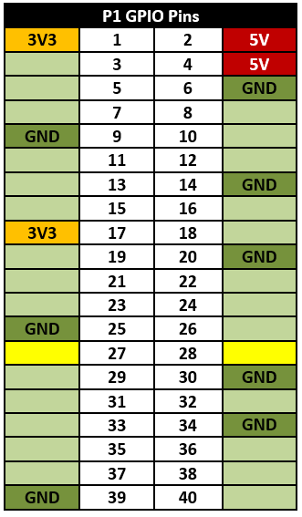
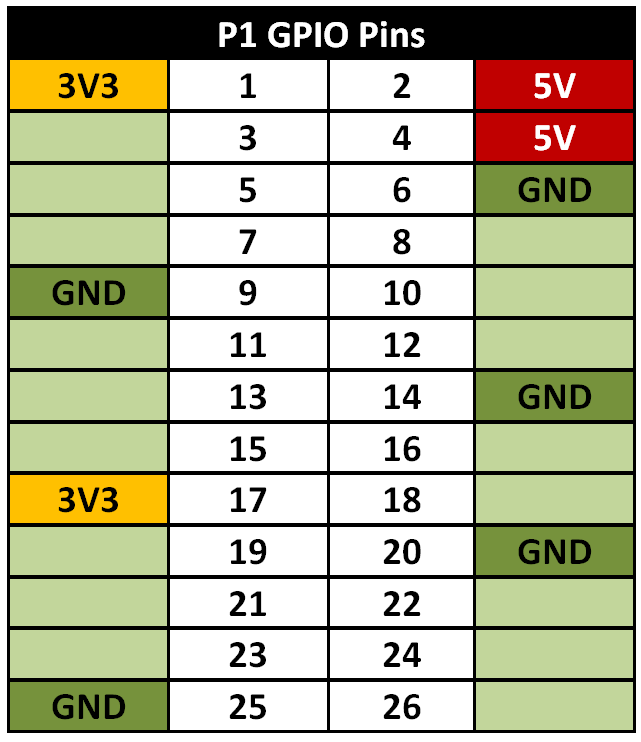
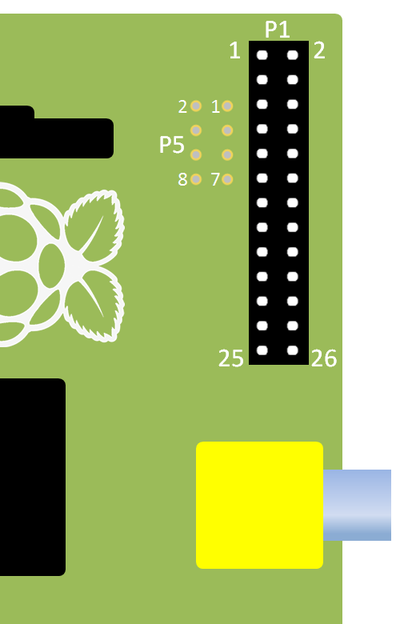
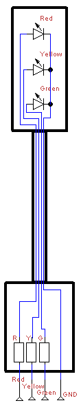
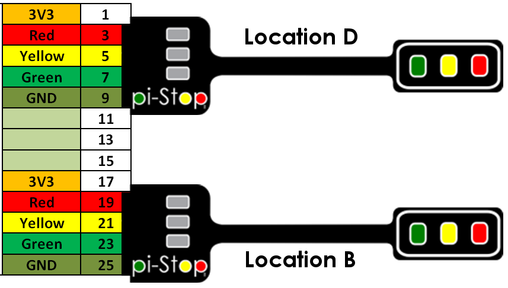
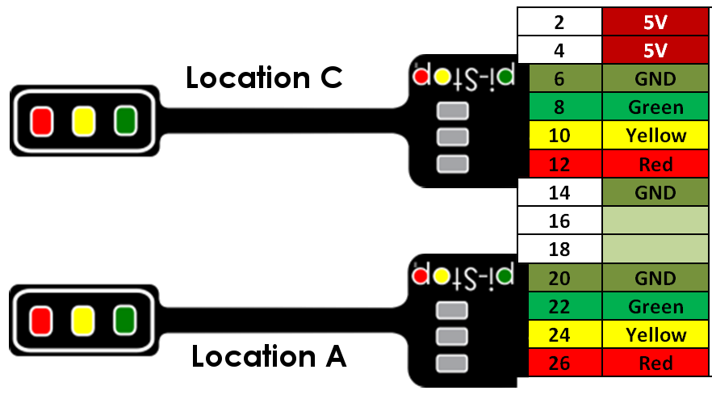

<!-- File generated from pihw.com (_inc\standard\start.txt) -->


<!-- How to use comments in these files -->
<!-- ---------------------------------- -->
<!--Comments have been put in this file so that they can be customised for a range of workshops and uses.

[How to customise the Markdown documents](CustomMarkdown.md)-->

<!-- -----------------------------------------------------
-->
<!-- Enable sections for the new model plus (Post-July 2014) define  -->
<!-- Enable sections for the older model (Pre-July 2014)  define  -->
<!-- -----------------------------------------------------
-->



----------

#Discover: The Pi-Stop#




##Using the Raspberry Pi GPIO##

The Raspberry Pi has a pin connector (GPIO Header) which includes 26 (17 on older models) general purpose input output pins, which provide the ability to digital control of hardware or sensing of digital signals.  The pin header also contains several power (5V & 3.3V) and ground pins, as shown below.
**Location A for Model A+, B+ or Raspberry Pi 2 (purchased after July 2014)**

> 
> **NOTE:**  Pins 27 and 28 are reserved for HAT (the Raspberry Pi add-on Hardware-On-Top support).
**For Model A or B (purchased before July 2014)**



> 
> **NOTE:**  3.3V is often written as 3V3 in diagrams, this makes it clear that the value is definitely 3.3V rather than mistaking it for 33V by missing the decimal point ".". 

We will refer to the main 40 pin (26 pin on older models) header as the GPIO Header (or sometimes as P1).
There are several conventions for referencing the GPIO pins, however where possible we will use the pin's physical position (where Pin 1 is located nearest the SD-Card and DSI connector and Pin 40 (pin 26 on older models) is near the USB port and the edge of the board).

**For Model A+, B+ or Raspberry Pi 2 (purchased after July 2014)**

**For Model A or B (purchased before July 2014)**


>
> **NOTE:** Sometimes you will see other names/references for these pins. This is because some of the GPIO pins also have additional special functions which support features such as 1Wire, I2C, SPI and serial (types of communication protocols) and PWM output (a special digital output mode).

Remember, you must never directly connect two pins together (called a short circuit), as this may permanently damage the Raspberry Pi (by allowing too much current to flow).

>
> **WARNING:** The Raspberry Pi can easily be damaged if you not careful when using the GPIO header.

The Pi-Stop includes three small resistors which will limit the current through the little LEDs, this protects the Raspberry Pi and also the LEDs.



>
> **TIP:** 
>Any circuit you connect to the Raspberry Pi should be designed to function using 3.3V logic and use low current signals.  If you wish to use more powerful hardware such as motors or 5V logic levels you will need additional circuits to drive them safely.
   

##Fitting the Pi-Stop##
We have selected standard locations for the Pi-Stop which are easy to locate and allow the unit to face outwards from the GPIO header.


**Location A for Model A+, B+ or Raspberry Pi 2 (purchased after July 2014)**
This will allow you to control up to six Pi-Stops at the same time!




>
> **NOTE:** 
>The Models A+, B+ and the Raspberry Pi 2 have two more supported locations **A+ and B+** compared to non "Plus" models.

**For Model A or B (purchased before July 2014)**
This also allows you to control up to four Pi-Stops at the same time!






**For Model A+ or B+ (purchased after July 2014)**

>
> **WARNING:** Extra care should be taken when using locations A, B C and D since they will not line up with the end of the GPIO header.

The pin references for each location are shown below:

>
> **NOTE:** 
>The Models A+, B+ and the Raspberry Pi 2 have two more supported locations **A+ and B+** compared to non "Plus" models.
**For Model A or B (purchased before July 2014)**
>
> **WARNING:** Extra care should be taken when using locations D and C since they will not line up with the end of the GPIO header.

The pin references for each location are shown below:




###Pi-Stop Default States###
When the Pi-Stop is connected and the Raspberry Pi is powered up you may notice that some LEDs are already lit.  This is due to the default settings of the Pins.  This can help you confirm that you have connected the Pi-Stop correctly.

**Default states for Model A+ or B+:**

- **Location A** - The Red and Yellow LEDs are ON
- **Location B** - All LEDs are OFF
- **Location C** - The Green LED is ON
- **Location D** - The Red and Yellow LEDs are ON
- **Location A+** - All LEDs are OFF
- **Location B+** - All LEDs are OFF

**Default states for Model A or B:**

- **Location A** - The Red and Yellow LEDs are ON
- **Location B** - All LEDs are OFF
- **Location C** - The Green LED is ON
- **Location D** - The Red and Yellow LEDs are ON


>
> **NOTE:** This may vary slightly if you have additional hardware enabled such as LCD screens etc. 

<!-- File generated from pihw.com (_incstandardstop.txt) -->