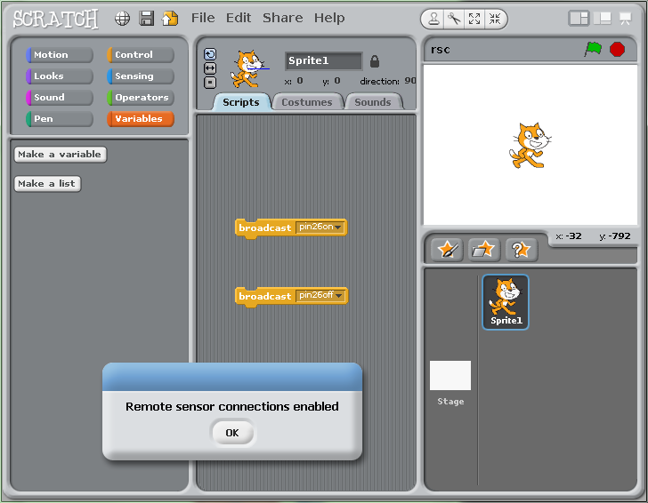
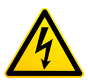
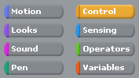
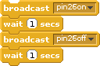
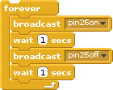

----------

#Explore and Challenge:#
##The Pi-Stop First Steps##

> 
> **SEE ALSO:**
>
> [**Discover: The Pi-Stop**](Discover-PiStop.md): For more information about Pi-Stop and how to use it.
>  
> [**Setup: Scratch GPIO**](Setup-ScratchGPIO.md): For instructions on how to setup Scratch GPIO with Pi-Stop *(which is needed for this guide)*.

We shall take our first steps using Scratch GPIO to control the Pi-Stop's LEDs.

###Getting Started###
The Pi-Stop should be connected to the Raspberry Pi in **Location A** (LEDs facing outwards), as follows:

###Run Scratch GPIO###
If you are still in the Raspberry Pi terminal, start the desktop environment using:

`startx
`

Otherwise, restart the desktop by logging out and back in again.

Open Scratch GPIO from the desktop using the Scratch GPIO icon (we do not need the *ScratchGPIO 5 Plus*):

**Scratch GPIO 5** is the standard version, while **Scratch GPIO 5 plus** provides additional support for several add-on boards.

> 
> **NOTE:** If you are using **X-Forwarding**, you can run Scratch GPIO with the following commands:
>
    sudo cp ~/.Xauthority ~root/
    sudo ~/scratchgpio5/./scratchgpio5.sh

###The Scratch Interface###
When Scratch GPIO starts it will look similar to the following:

This is just the same as the normal Scratch interface - the only difference is the hidden background GPIO handler started at the same time (and the message window).

The first thing you will find is a small window with the message `"Remote sensor connections enabled"`.  This indicates that the GPIO handler (the part which is listening for the **broadcast** commands from Scratch is active and ready.

You can press **OK** to clear this message.

> **WARNING:** If for some reason this doesn't show, check you clicked on **ScratchGPIO 5** rather than the normal **Scratch** icon.
>
>Otherwise, try **rebooting** (terminal command `sudo reboot`) just in case something you ran previously hasn't released the GPIO for example.  Finally, you can try re-installing Scratch GPIO by re-running the install scripts.

Next you will see the standard Scratch interface which is split into three main sections (left to right):

####1 - *Command Blocks Section*####
This is where you select the various types of blocks you can use to make your scripts from.  The blocks are organised into 8 different types depending on their function/use.  When you wish to use a block, simply drag and drop them over into the space to the right.

####2 - *Program Script Area*####
This is where you build your scripts by locking various blocks together.  If you double click on a block (group of blocks) it will run immediately, otherwise they will run according to events which are triggered (from key presses, the actions by the sprite/in the canvas or using the **green flag** icon and block).

> 
> **TIP:** Each sprite (the default is our friend *Scratch*) can contain their own set of scripts (so if you create extra sprites your scripts will only appear in the one you first built them in).

####3 - *Canvas and Sprites*####
The Canvas area is typically where things happen in the Scratch world.  Usually we interact with the sprites (such as Scratchy) or draw things on the Canvas to see the results from our script.

However since we are also making things happen in the **real world** by using the GPIO pins we don't have to use the canvas to see something happen, the results of our script will be produced by the Pi-Stop instead.  

 **WORKSHEET:** Tick the checkbox marked **"I now know the different parts of Scatch"**

*Lets now introduce the blocks we will use in our first example.*
 

###The broadcast block###
The **broadcast** block, is located in the **control** section:

You may have already come across the **broadcast** block previously while setting up **Scratch GPIO**.  This block simply announces a message to anything which is listening.

In this case, `pin26on` is a message which **GPIO Scratch** understands, and will cause **Pin 26** of the GPIO header to switch **on** which will light up the Red light of the **Pi-Stop**.

By default **Scratch GPIO** will start with two **broadcast** blocks, `pin26on` and `pin26off`.

If they are not, you can add your own using the following steps:

1. Select the **control** section in the top-left of the Scratch window.
2. Drag over a **broadcast** block and click on the text space and add a *"new..."* message.
3. Type in `pin26on` for the first, and `pin26off` for the second.

###The wait block###
Next we will take a wait block, again from the **control** section.

1. Select the **control** section in the top-left of the Scratch window.
2. Drag over two **wait** blocks.
3. Form together the four blocks into the following shape.

You can test the block by clicking on it, you should see the Red LED of the Pi-Stop switch on for 1 second and then go off automatically.

###The forever block###
The final block in this section, is called a **forever** block, this will cause anything it contains to repeat over and over for...well...forever!

1. Select the **control** section in the top-left of the Scratch window.
2. Drag over a forever block.
3. Move the group of **broadcast** and **wait** into the middle of the **forever** block, you will find that it clicks into place to make the following block.

When you test it this time, by clicking on it, you will find the flashing LED sequence continues to repeat over and over.

 **WORKSHEET:** Tick the checkbox marked **"Scratch GPIO with a Flashing RED Light Completed!"**

Remember to save your completed work by selecting **File** and **Save As...** from the menu.

*Congratulations you have created your first Scratch GPIO program with the Pi-Stop!*

*You are now ready to move onto the next guide:*

[**Explore and Challenge Scratch GPIO: Pi-Stop Traffic Sequence**](ExploreScratchGPIO-PiStopTrafficSequence.md).
