----------

#Explore and Challenge:#
##The Pi-Stop Traffic Light Sequence##

> 
> **SEE ALSO:**
>
> [**Discover: The Pi-Stop**](Discover-PiStop.md): For more information about Pi-Stop and how to use it.
>  
> [**Setup: Scratch GPIO**](Setup-ScratchGPIO.md): For instructions on how to setup Scratch GPIO with Pi-Stop *(which is needed for this section)*.
>
> [**Explore and Challenge Scratch GPIO: Pi-Stop First Steps**](ExploreScratchGPIO-PiStopTrafficSequence.md): If you've not used Scratch before, this will provide a quick introduction to building your first Scratch GPIO program.

In this guide we make use of Scratch GPIO produce a standard traffic light sequence with the Pi-Stop.

###Getting Started###
The Pi-Stop should be connected to the Raspberry Pi in Location A, as follows:

With the Pi-Stop fitted in the correct position you can now power up your Raspberry Pi.

###Run Scratch GPIO###
If you are still in the Raspberry Pi terminal, start the desktop environment using:

`startx
`

Open Scratch GPIO from the desktop using the Scratch GPIO icon (we do not need the *ScratchGPIO 5 Plus*):
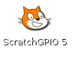

**Scratch GPIO 5** is the standard version, while **Scratch GPIO 5 plus** provides additional support for several add-on boards.

> 
> **NOTE:** If you are using **X-Forwarding**, you can run Scratch GPIO with the following commands:
>
    sudo cp ~/.Xauthority ~root/
    sudo ~/scratchgpio5/./scratchgpio5.sh

###Get ready###
In this example we will use the following blocks, all of which are located in the **control** section:
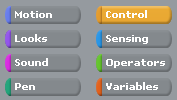

We will use one or more of the following:

- **broadcast** blocks

- **wait** blocks

- **when I receive** blocks

- **forever** block

> 
> **NOTE:** For more information on the **broadcast**, **wait** and **forever** blocks see
> [**Explore and Challenge Scratch GPIO: Pi-Stop First Steps**](ExploreScratchGPIO-PiStopTrafficSequence.md) which introduced them for the first time.

###Designing our traffic sequence###

Before we go any further we should take some time to work out what the correct sequence of lights a traffic light should show.  This way we can design our program and then test to see if it behaves as we wanted.
####The STOP Sequence####
**QUESTION:** When a traffic light is ***GREEN (GO)*** and starts to change, what lights will be lit as it changes to ***STOP*** the traffic?
 
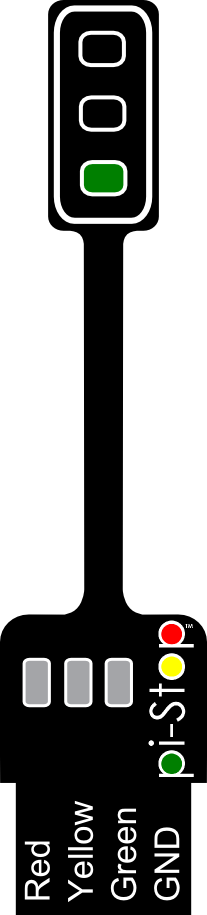
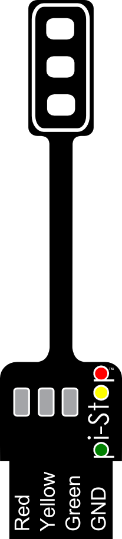

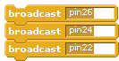

 **WORKSHEET:** On your worksheet colour in the correct traffic light sequence, starting with ***GREEN*** (as shown above) and ending with the light showing ***STOP***.

**WORKSHEET:** On the broadcast blocks fill in the required commands to switch **on** or **off** the appropriate LEDs (by switching **on** or **off** the pins),

####The GO Sequence####
**QUESTION:** When a traffic light is ***RED (STOP)*** and changes to ***GO***, what is the normal sequence of lights?

Again, fill in the required **broadcast** commands.
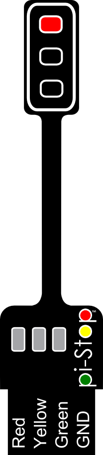

 **WORKSHEET:** On your worksheet colour in the correct traffic light sequence, starting with ***RED*** and ending with the light showing GO.

**WORKSHEET:** Again, complete the required broadcast blocks to switch each of the lights on or off. 

*Great work!*

*You can now create each of the **broadcast** blocks in Scratch and click on them to test each step.*

###Putting the blocks together###
We will now create a new **broadcast** group of blocks to recreate the required LED sequence.
####The broadcast STOP Block####
Start the group with a **when I receive** block called **STOP**:

Add our first light change:

Add a wait block (so the lights do not change instantly):

Add our second light change:

####Broadcast GO Block####
Simply do the same with the other light changes, but call this **when I receive** block **GO**:

***Excellent!*** *Now you can test these blocks by clicking on them directly and see if we have our correct traffic light sequences!*

 **WORKSHEET:** Tick the checkbox marked **"I've created the Pi-Stop STOP and GO sequences"**

##The Final Program - Changing Lights##
At the moment our program will not do anything unless we click on it.

Just like we did in the previous guide ([**Explore and Challenge Scratch GPIO: Pi-Stop First Steps**](ExploreScratchGPIO-PiStopTrafficSequence.md)) we will use a **forever** block to repeat our sequence.

We will also add a **when green flag clicked** block to kick off our sequence (allowing you to use the small flag in the top right to **start**, and the red circle to **stop**. 

For our traffic lights we want them to start by changing to **GO** (by broadcasting "GO") then wait for some time (for example 10 seconds) and then change to **STOP** (by broadcasting "STOP").

Putting the blocks together we end up with:
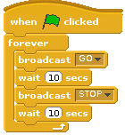

When you run the program (by clicking on the **Green Flag**) you will see each part is highlighted with a white outline while it runs through the **forever** loop and runs each of the **broadcast** group blocks **GO** and **STOP**.

 **WORKSHEET:** Tick the checkbox marked **"I've created the Pi-Stop the full Traffic Light Sequence"**

Remember to save your completed work by selecting **File** and **Save As...** from the menu.

###Behold the Changing Lights!###

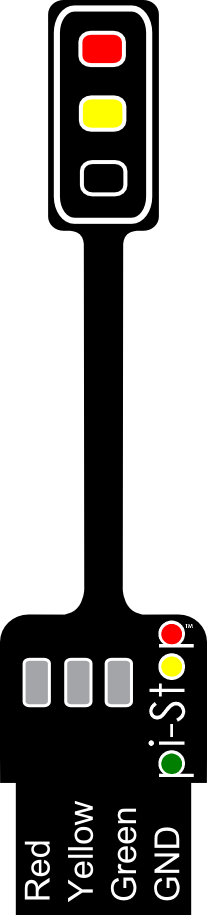

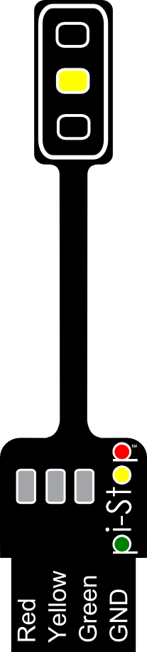

##Try your own projects...##
Now you have your very own traffic light you can use in your own projects!

*Below are some ideas, or you can move onto the next guide:*

[**Explore and Challenge Scratch GPIO: Pi-Stop Reaction Game**](ExploreScratchGPIO-PiStopReactionGame.md).

###Start a race###
 **IDEA:** Fed up with unfair starts when starting a race?  Why not start your races with your own starting lights!

Use the Pi-Stop to start your **Scalextric** (TM) or **Hot Wheels** (TM) races, ensuring everyone gets a fair chance.

**QUESTION:** Can you create a Formula 1 style starting lights (where each light lights up and they all go off, the race starts when the lights are off).

**QUESTION:** Can you change the program to make the light change with a random wait time (making it harder to go before they change)?

*Hint: See the next guide ([**Explore and Challenge Scratch GPIO: Pi-Stop Reaction Game**](ExploreScratchGPIO-PiStopReactionGame.md)) which makes use of random delays.*

 **WORKSHEET:** Tick the checkbox marked **"Extended Task: Created a racing start light control"**

###Control multiple Traffic Lights###
 **IDEA:** Perhaps your **LEGO City** (TM) needs some traffic control.
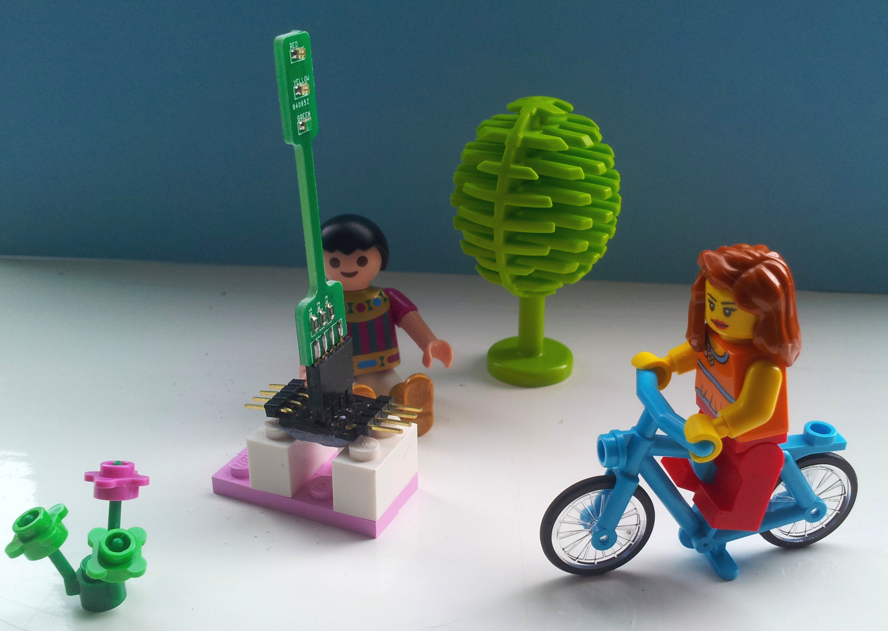

**QUESTION:** Can you extend the traffic light sequence to use a second **Pi-Stop** fitted in **Location B** so you can control traffic at a junction?

*If you want to try this, please ask for an extra Pi-Stop to use in your project.*

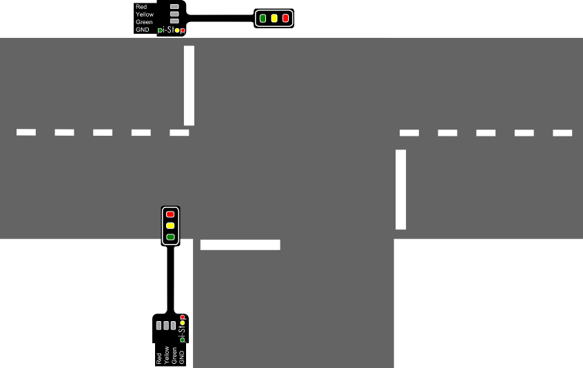
*Hint: You will need to create new **broadcast** blocks using the 2nd set of pins. Also, think about giving drivers time to react before the other set of lights turns GREEN!*

 **WORKSHEET:** Tick the checkbox marked **"Extended Task: Controlled two Pi-Stops at the same time!"**

*The next guide is:*

[**Explore and Challenge Scratch GPIO: Pi-Stop Reaction Game**](ExploreScratchGPIO-PiStopReactionGame.md).