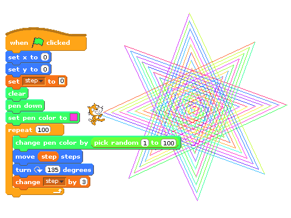
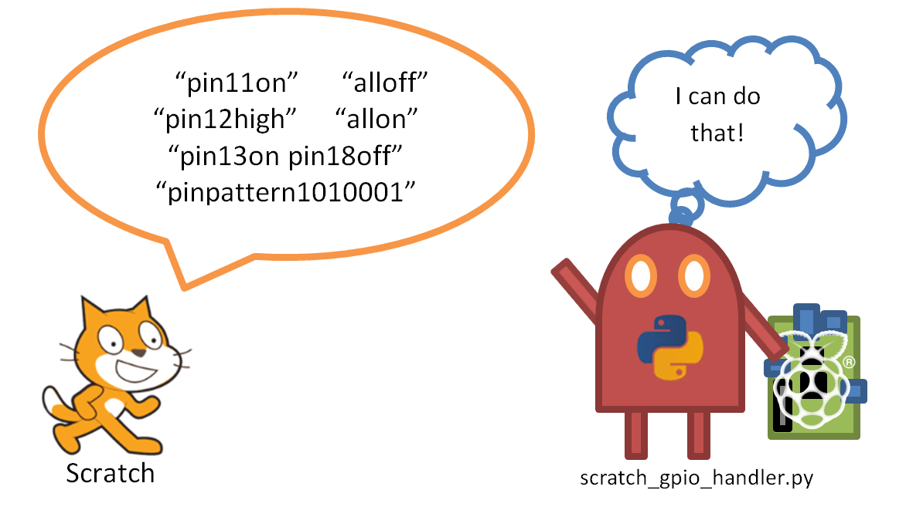
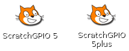
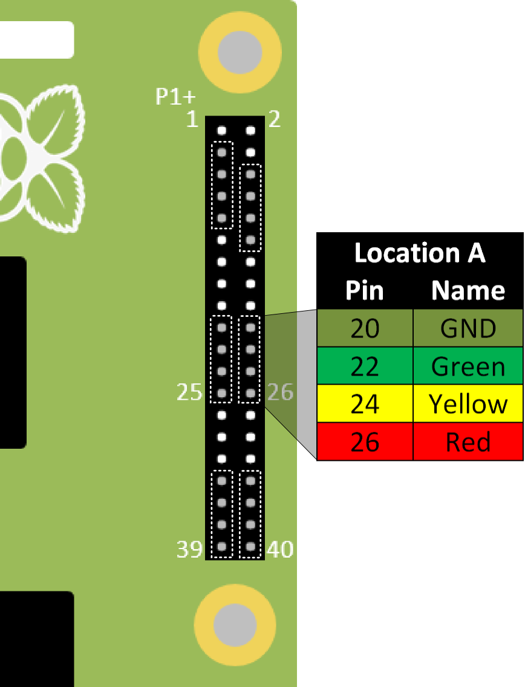
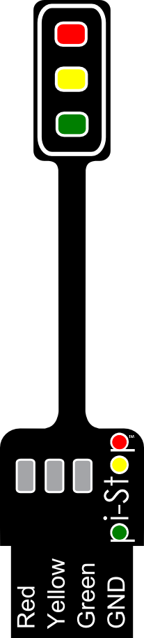
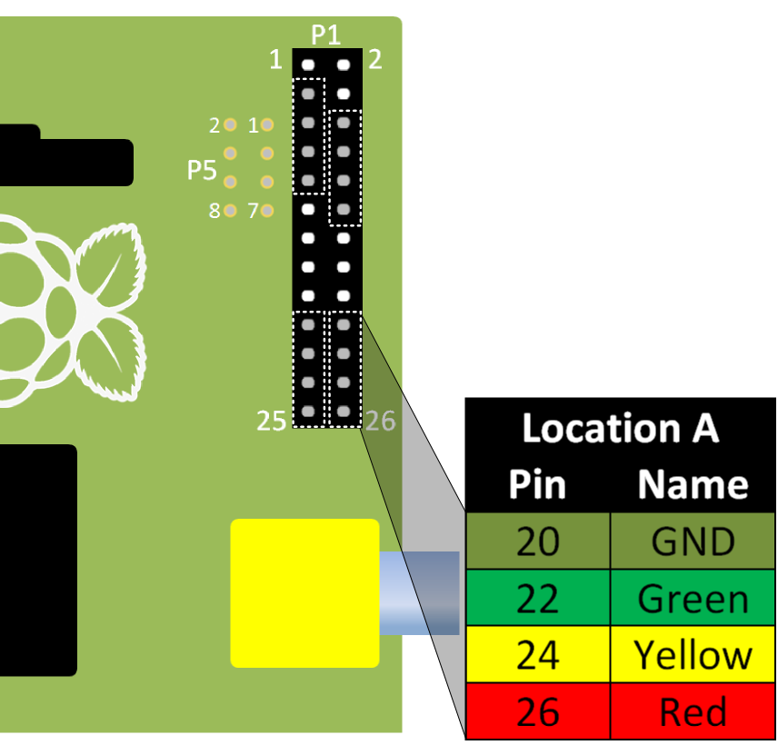
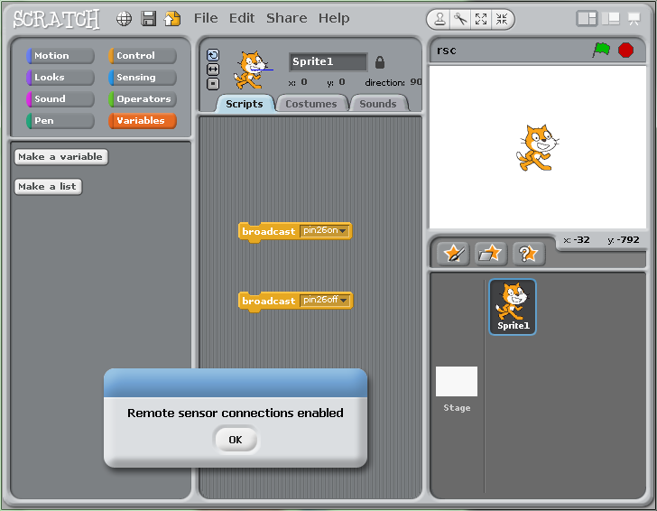
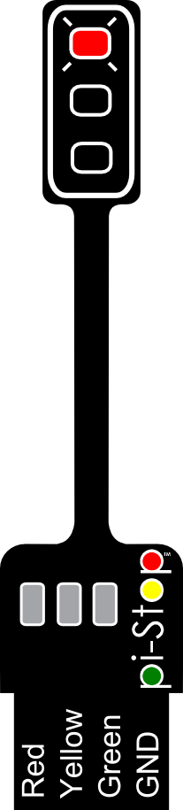

<!-- How to use comments in these files -->
<!-- ---------------------------------- -->
<!--

Comments have been put in this file so that they can be customised for a range of workshops and uses.

[How to customise the Markdown documents](CustomMarkdown.md)

For normal html comments use 2 "-" i.e.:
Use "<!-- This comment" with "--"">" to end it.

For compiler directive commands use 3 "-"
for the comments i.e.:
1. Use "<!---#define WANT_SOMETHING" with "---"">" to enable a particular section.
2. Use "<!---#ifdef WANT_SOMETHING" with "---"">" to create an optional section.
3. Ensure you use "<---#end" with "---"">" to indicate the end of the optional section.
-->

<!-- -----------------------------------------------------
-->
<!-- Enable sections for the new model plus (Post-July 2014) -->
<!---#define WANT_MODEL_PLUS--->
<!-- Enable sections for the older model (Pre-July 2014) -->
<!---#define WANT_MODEL_ORG--->
<!-- -----------------------------------------------------
-->

----------
#Setup: Scratch GPIO#

##What is Scratch?##
**Scratch** is a beginner friendly way to program the Raspberry Pi, designed for those who have not programmed before and are put off by the random keyboard mashing type code normal programming typically produces.

Programs are simply created by dragging and dropping various types of blocks together to produce a sequence of instructions to follow.  The default character who is tasked with following all these instructions is “Scratch” the cat!

An typical program is shown below:

On the surface Scratch is deceptively simple, however don’t let that fool you, there is a lot that can be done by putting a few blocks together and because you are not distracted by syntax, you can really focus on the design and the task.

##Introducing Scratch GPIO##
**Scratch GPIO** was created by **Simon Walters (@cymplecy)** to allow Scratch to interact with physical hardware.  Full details of Scratch GPIO is available on his website:

[http://cymplecy.wordpress.com/scratchgpio/](http://cymplecy.wordpress.com/scratchgpio/)

##How to install Scratch GPIO##
###Obtain Scratch GPIO###
If an internet connection is available, obtain the Scratch GPIO setup file by running the following command.

    sudo wget http://goo.gl/Pthh62 –O install_scratchgpio5.sh

Or download the file directly on another computer and copy it to your Raspberry Pi:

[http://goo.gl/Pthh62](http://goo.gl/Pthh62)

###Run the install script###
Run the script to install Scratch GPIO using the following command:

    sudo bash install_scratchgpio5.sh

> 
> **NOTE:** If you have a different user name to the default pi user, use the following command:

>    `sudo bash install_scratchgpio5.sh yourid`

It is as simple as that, Scratch GPIO is installed on your system!

> 
> **TIP:** How to access data copied to the SDCard

>If you are using NOOBS, only the RECOVERY partition of the SDCard will be visible in windows.  To access this partition on the Raspberry Pi it will need to be mounted using the following commands:
>
>`mkdir ~/recovery`
>
>`mount xxxxx ~/recovery`
>
>`cd ~/recovery`
>
>You can now run the script directly from here.

>If using a basic imaged system, the BOOT partition can be accessed with:
>
>`cd /dev/boot`

##How does it work?##
###The broadcast block###
In addition to the direct instructions as shown above, Scratch is able to *shout* (called **broadcast**) messages to anything which is listening.

###The Scratch GPIO Helper###
   
Scratch GPIO is a slightly modified version of standard Scratch which has an additional helper (*scratch_gpio_handler.py*) running in the background.  The GPIO helper listens for any **broadcast** massages which it understands and controls the connected hardware accordingly.

##Run Scratch GPIO##
If you are still in the Raspberry Pi terminal, start the desktop environment using:

`startx
`

Otherwise, restart the desktop by logging out and back in again.

When the desktop has reloaded, you will discover two new icons:

**Scratch GPIO 5** is the standard version, while **Scratch GPIO 5 plus** provides additional support for several add-on boards.

> 
> **NOTE:** If are using **X-Forwarding**, you can run Scratch GPIO with the following commands:
>
    sudo cp ~/.Xauthority ~root/
    sudo ./scratchgpio5.sh

###Performing our first test with Pi-Stop###
The Pi-Stop should be connected to your Raspberry Pi GPIO header P1 using **Location A**, as follows:
<!---#ifdef WANT_MODEL_PLUS--->
**Location A for Model A+ or B+ (purchased after July 2014)**

<!---#endif--->
<!---#ifdef WANT_MODEL_ORG--->
**Location A for Model A or B (purchased before July 2014)**

<!---#endif--->

> 
> **SEE ALSO:**
> 
> For more information about Pi-Stop and how to use it see: **Discover: The Pi-Stop**

Before you start Scratch GPIO you will probably see the Red and Yellow LEDs are ON.  Once you have started Scratch GPIO and it has enabled the remote sensor connections, you should find that these LEDs have switched OFF or dimmed.

###Take control###
The program starts with two default Broadcast blocks, with the messages *pin26on* and *pin26off* setup.  

We can immediately control our Traffic light by clicking on each of the broadcast blocks to switch *on* or *off* the **Red light** of our Pi-Stop.
