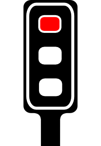
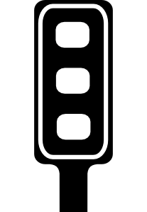
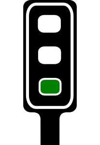
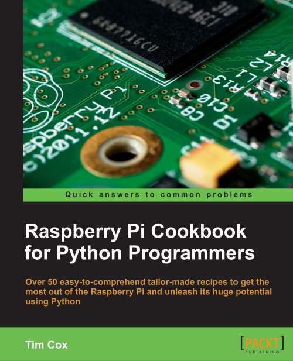

<!---#include "define.txt"--->
<!---#include "start.txt"--->
<!-- How to use comments in these files -->
<!-- ---------------------------------- -->
<!--Comments have been put in this file so that they can be customised for a range of workshops and uses.

[How to customise the Markdown documents](CustomMarkdown.md)-->

<!-- -----------------------------------------------------
-->
<!-- Enable sections for the new model plus (Post-July 2014) define WANT_MODEL_PLUS -->
<!-- Enable sections for the older model (Pre-July 2014)  define WANT_MODEL_ORG -->
<!-- -----------------------------------------------------
-->

----------

##NAME:##
-----------------

<!---#ifdef ALT_LINK--->
<!---
##<a href="FILE_SRC/Setup-ScratchGPIO.FILE_SRC_EXT">**Setup: Scratch GPIO**</a>##
--->
<!---#else--->
##[**Setup: Scratch GPIO**](Setup-ScratchGPIO.md)##
<!---#endif--->

Explains how to setup Scratch GPIO.

*You must perform this step in order to use the **Pi-Stop** with Scratch.*
 **I have installed Scratch GPIO!**

 **I have powered down the Raspberry Pi and fitted the Pi-Stop in Location A**

<!---#ifdef WANT_MODEL_PLUS--->
**Location A for Model A+, B+ or Raspberry Pi 2 (purchased after July 2014)**

<!---#endif--->
<!---#ifdef WANT_MODEL_ORG--->
**Location A for Model A or B (purchased before July 2014)**

<!---#endif--->

 **I have tested Scratch GPIO with the Pi-Stop and it works!** 

<!---#ifdef ALT_LINK--->
<!---
##<a href="FILE_SRC/ExploreScratchGPIO-PiStopFirstSteps.FILE_SRC_EXT">**Explore and Challenge Scratch GPIO: Pi-Stop First Steps**</a>##
--->
<!---#else--->
##[**Explore and Challenge Scratch GPIO: Pi-Stop First Steps**](ExploreScratchGPIO-PiStopFirstSteps.md)##
<!---#endif--->

Introduces how to use Scratch and using Scratch GPIO.

*If you are already familiar with Scratch you can skip this.*
 **I now know the different parts of Scatch**

 **Scratch GPIO with a Flashing RED Light Completed!**

<!---#ifdef ALT_LINK--->
<!---
##<a href="FILE_SRC/ExploreScratchGPIO-PiStopTrafficSequence.FILE_SRC_EXT">**Explore and Challenge Scratch GPIO: Pi-Stop Traffic Sequence**</a>##
--->
<!---#else--->
##[**Explore and Challenge Scratch GPIO: Pi-Stop Traffic Sequence**](ExploreScratchGPIO-PiStopTrafficSequence.md)##
<!---#endif--->

Create your own traffic light sequence and learn how to use Scratch GPIO with the **Pi-Stop**.

**WORKSHEET:** Colour in the correct traffic light order below, then fill in the required **broadcast** commands **on** or **off**.
Use the following diagram to determine which pins are connected with each colour on the traffic light.

First the traffic light sequence for changing from **STOP** to **GO**.
#STOP#

-----------------
#PREPARE TO GO#

-----------------
#Wait#
To stop the lights changing instantly, we need to wait before we change them again!

-----------------
#GO#

**Traffic Light Sequence STOP to GO**

------------------
------------------
Next the traffic light sequence for changing from **GO** back to **STOP**. 
#GO#

-----------------
#PREPARE TO STOP#

-----------------
#Wait#
Again, to stop the lights changing instantly, we need to wait.

-----------------

#STOP#

**Traffic Light Sequence GO to STOP**

--------

**I've created the Pi-Stop STOP and GO sequences**

**I've created the Pi-Stop the full Traffic Light Sequence**

**Extended Task: Created a racing start light control**

**Extended Task: Controlled two Pi-Stops at the same time!**

<!---#ifdef ALT_LINK--->
<!---
##<a href="FILE_SRC/ExploreScratchGPIO-PiStopReactionGame.FILE_SRC_EXT">**Explore and Challenge Scratch GPIO: Pi-Stop Reaction Game**</a>##
--->
<!---#else--->
##[**Explore and Challenge Scratch GPIO: Pi-Stop Reaction Game**](ExploreScratchGPIO-PiStopReactionGame.md)##
<!---#endif--->

How fast are your reflexes?  Test your reaction time with the Pi-Stop Reaction game.

 **WORKSHEET:** Tick the checkbox marked **"I've created the Pi-Stop Reaction Game"**.

***Don't forget to write down your best score!***

<!---#ifdef ALT_LINK--->
<!---
##<a href="FILE_SRC/ExploreScratchGPIO-PiStopSimonGame.FILE_SRC_EXT">**Explore and Challenge Scratch GPIO: Pi-Stop Simon Memory Game**</a>##
--->
<!---#else--->
##[**Explore and Challenge Scratch GPIO: Pi-Stop Simon Memory Game**](ExploreScratchGPIO-PiStopSimonGame.md)##
<!---#endif--->

Challenge your memory and get the highest score!

 **WORKSHEET:** Tick the checkbox marked **"The first part of the Pi-Stop Simon Memory Game works!"**.

 **WORKSHEET:** Tick the checkbox marked **"I've created the Pi-Stop Simon Memory Game"**.

***Don't forget to write down your best score!***

--------------------
**Congratulations: You have reached the end of the workshop!**

I hope you enjoyed it.

***You can buy your own Pi-Stop today, £3 each or two for £5.***

The **Pi-Stop** are also available to buy from [www.4tronix.co.uk](http://www.4tronix.co.uk), and additional material and guides are available from my website [www.PiHardware.com ](http://www.PiHardware.com )

> For further Raspberry Pi help/advice or to enquire about **classroom/workshop packs**:

> Contact  me (Tim Cox) at [pihw-orders@hotmail.co.uk](pihw-orders@hotmail.co.uk)

My ***Raspberry Pi Python Cookbook for Python Programmers*** is available to buy:

**[http://goo.gl/dmVtsc](http://goo.gl/dmVtsc)**

<!---#include "stop.txt"--->
