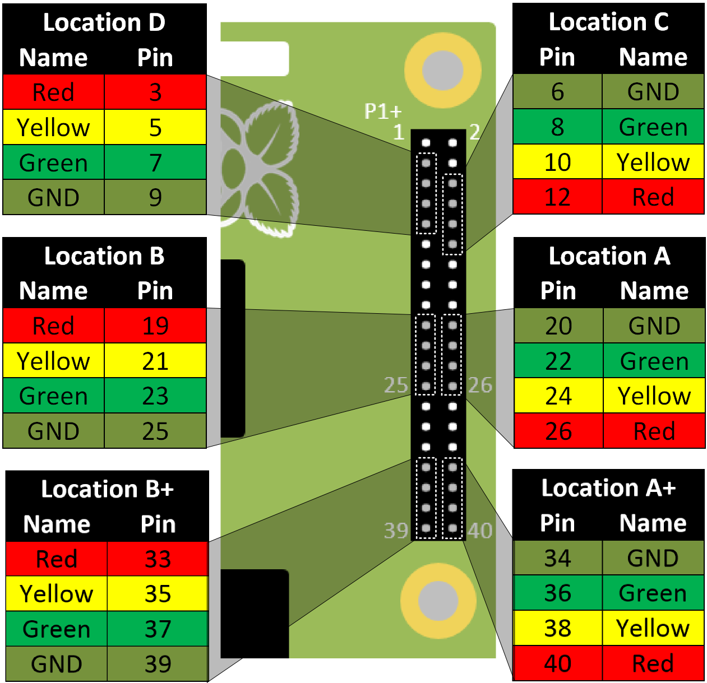

<!---#include "define.txt"--->
<!---#include "start.txt"--->
#Test file#
<!-- How to use comments in these files -->
<!-- ---------------------------------- -->
<!--
## This is just an idea at the moment, however this may be a good way to create common worksheets which are adaptable for everyone! ## 

Comments have been put in this file so that they can be customised for a range of workshops and uses.

The convention will be to create a TAG for your purpose and add this to the top of the file with a description.  ## More details will be added when I've experimented further with this concept ##

You can then add comments around any specific sections you need for your workshop and allow others to use the same setups (i.e. if you change to using different hardware you can have alternative sections which describe using that hardware instead of the Pi-Stop).

Once established, we can switch between setups by using a Python Script to generate specific PDFs based on the selected TAGS.

## This is just an idea at the moment, however this may be a good way to create common worksheets which are adaptable for everyone! ## 
-->
#Testing with defines#
<!-- -----------------------------------------------------
-->
<!-- Enable sections for the new model plus (Post-July 2014) define WANT_MODEL_PLUS -->
<!-- Enable sections for the older model (Pre-July 2014)  define WANT_MODEL_ORG -->
<!-- -----------------------------------------------------
-->

#Testing with WANT_ONLINE_IMG_PATH#
<!---#define WANT_ONLINE_IMG_PATH--->

<!---
#ifdef WANT_ONLINE_IMG_PATH

#else
--->

<!---#endif--->

#Testing with ONLINE_IMG_PATH#
<!---#define ONLINE_IMG_PATH https://raw.githubusercontent.com/PiHw/Pi-Stop/master/markdown_source--->
<!---
#ifdef WANT_ONLINE_IMG_PATH

#else
--->

<!---#endif--->

#Testing with IMG_PATH#

<!---
#define ONLINE_IMG_PATH https://raw.githubusercontent.com/PiHw/Pi-Stop/master/markdown_source/img
#define LOCAL_IMG_PATH img
--->

<!---
#ifdef WANT_ONLINE_IMG_PATH
#define IMG_PATH ONLINE_IMG_PATH
#else
#define IMG_PATH LOCAL_IMG_PATH
#endif
--->

<!---
#ifdef IMG_PATH

#else
--->

<!---#endif--->

<!---#ifdef WANT_MODEL_PLUS--->
##GPIO Connections for Model A+ and B+##

<!---#endif--->

<!---#ifdef WANT_MODEL_ORG--->
##GPIO Connections for Model A and B##

<!---#endif--->

<!--Use the following commandline:-->
<!--  .\win-gpp\gpp.exe -DTEST1 -o ..\markdown_generated\testing#.md output.txt -->
<!---#ifdef TEST1--->
<!---#TEST WORKED#--->
<!---#endif--->

<!--This is a standard comment-->

<!---#define KEEP--->

<!---#ifdef KEEP--->
Keep this text (always defined within the file)
<!---#endif--->

<!---#ifndef KEEP--->
Do not keep this text (defined within the file)
<!---#endif--->

<!---#ifdef ENABLED--->
This text is only shown if enabled (using an external define)
<!---#else--->
This text is shown if disabled
<!---#endif--->

#Dealing with image references#
We treat image references as a special case, anything with img / will be converted to IMG_ SRC by our TextParser.
We can then define IMG_ SRC to be our webpage path for images:
i.e. https://raw.githubusercontent.com/PiHw/Pi-Stop/master/markdown_source/img/
This allows us to define a new path for the images.
 

Text always here

<!---#ifdef WEBVER--->
#Dealing with markdown file references - using define WEBVER#
HTML Version
> <a href="FILE_SRC/Discover-PiStop.md">**Discover: The Pi-Stop**</a>: For more information about Pi-Stop and how to use it.
 
Markdown Version

> [**Discover: The Pi-Stop**](FILE_SRC/Discover-PiStop.md): For more information about Pi-Stop and how to use it.
<!---#else--->
#Dealing with markdown file references - using find and replace#
> [**Discover: The Pi-Stop**](Discover-PiStop.md): For more information about Pi-Stop and how to use it.
<!---#endif--->

<!---#include "stop.txt"--->