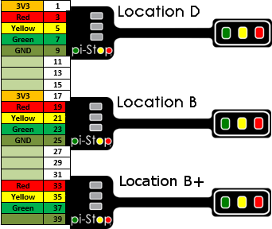

<!-- How to use comments in these files -->
<!-- ---------------------------------- -->
<!--
## This is just an idea at the moment, however this may be a good way to create common worksheets which are adaptable for everyone! ## 

Comments have been put in this file so that they can be customised for a range of workshops and uses.

The convention will be to create a TAG for your purpose and add this to the top of the file with a description.  ## More details will be added when I've experimented further with this concept ##

You can then add comments around any specific sections you need for your workshop and allow others to use the same setups (i.e. if you change to using different hardware you can have alternative sections which describe using that hardware instead of the Pi-Stop).

Once established, we can switch between setups by using a Python Script to generate specific PDFs based on the selected TAGS.

## This is just an idea at the moment, however this may be a good way to create common worksheets which are adaptable for everyone! ## 
-->
#Tesing with defines#

<!--Commented out define WANT_MODEL_ORG-->

##GPIO Connections for Model A+ and B+##





